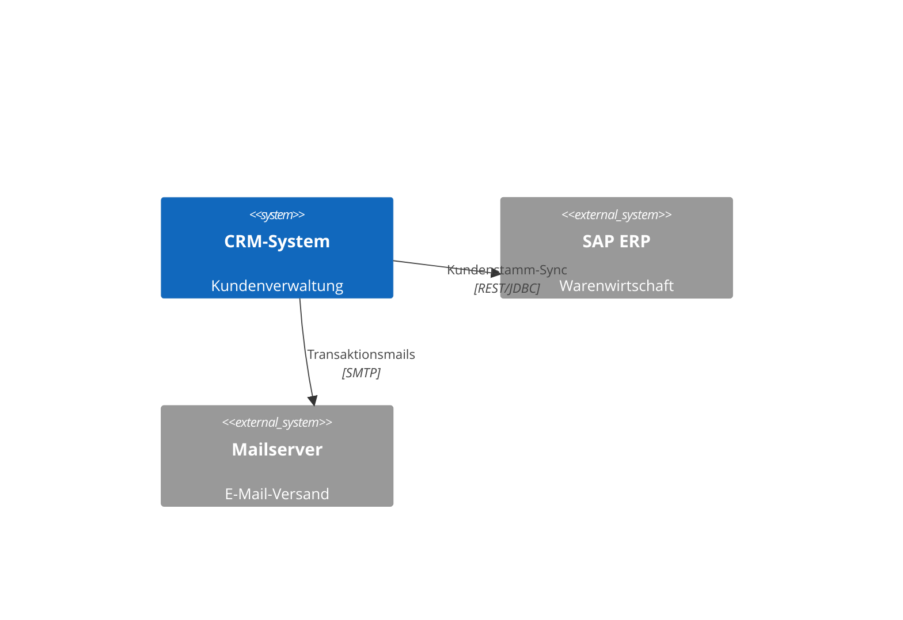

# Arc42 Dokumentations-Framework

## Zweck

Das Arc42-Framework in OEA ermöglicht es, strukturierte Architektur-Dokumentation nach Arc42-Vorlage direkt im Tool zu pflegen — verknüpft mit dem EA-Modell, nicht getrennt davon. Es ergänzt die EA-Landschaftssicht (TOGAF-orientiert) um die **Lösungsebene** (Arc42-orientiert) für einzelne Systeme.

Arc42 ist ein Dokumentations-Template, kein Vorgehensmodell. OEA nutzt es als konfigurierbares Schichtsystem:
1. **Metamodell-Ebene**: Wer muss was dokumentieren? (Arc42ChapterCollection → EntityTypeDefinition)
2. **Instanz-Ebene**: Was wurde für dieses System dokumentiert? (Arc42MetaObject-Entitäten per System)

## Kernkonzepte

### Arc42MetaObject (built-in EntityType)

`arc42-meta-object` ist ein eingebauter, erweiterbarer EntityType mit `isConnection=false`. Er ist die Basis aller Arc42-Frage-Antworten. Jede Antwort auf eine Arc42-Frage ist eine Entität dieses Typs (oder eines abgeleiteten Subtyps).

| Attribut | Typ | Optional | Beschreibung |
|---|---|---|---|
| id | integer | required | Fortlaufende Integer-ID (gemeinsamer Nummernraum mit allen anderen Entitäten) |
| entityTypeId | string | required | `arc42-meta-object` oder ein Subtyp davon (z.B. `arc42-context-view`) |
| name | string | required | Kurzbezeichnung der Antwort (z.B. „Kontextabgrenzung CRM-System") |
| content | rich-text | required | WYSIWYG-Inhalt; unterstützt Markdown, Mermaid-Codeblöcke und PlantUML-Codeblöcke |
| questionRef | string | optional | ID der `Arc42QuestionTemplate`, die diese Antwort beantwortet |

**Subtypen** können via `extends: arc42-meta-object` auf EntityTypeDefinition-Ebene definiert werden. Damit können zusätzliche Properties für spezifische Kapitel ergänzt werden (z.B. `qualityLevel` für §10 Qualitätsanforderungen).

### Arc42Describes (built-in Connection-Typ)

`arc42-describes` ist ein eingebauter Connection-Typ mit `isConnection=true`. Er verknüpft eine Arc42MetaObject-Instanz mit der dokumentierten Entität (dem „Subject").

| Attribut | Typ | Beschreibung |
|---|---|---|
| sourceEntityId | integer | Arc42MetaObject-Instanz (Typ: arc42-meta-object oder Subtyp) |
| targetEntityId | integer | Dokumentiertes Objekt (beliebiger EntityType, z.B. application-component) |

Über diese Verbindung kann das System zu jeder Entität alle zugehörigen Arc42-Antworten abrufen (`GET /api/v1/entities/{id}/arc42`) und umgekehrt zu jeder Antwort das dokumentierte Objekt finden.

### Arc42ChapterCollection (Metamodell-Objekt)

Eine `Arc42ChapterCollection` ist eine benannte, geordnete Liste von Frage-Templates. Sie wird im MetamodelConfiguration gespeichert und mindestens einem `EntityTypeDefinition` zugewiesen.

| Attribut | Typ | Optional | Default | Beschreibung |
|---|---|---|---|---|
| id | string | required | | kebab-case; global eindeutig in der MetamodelConfiguration |
| name | string | required | | Anzeigename (z.B. „Standard Arc42", „Minimal Arc42 KMU") |
| description | string | optional | null | Beschreibung des Sammlungszwecks |
| assignedEntityTypeIds | string[] | required | [] | EntityTypeDefinition-IDs, für die diese Sammlung gilt |
| questions | Arc42QuestionTemplate[] | required | [] | Geordnete Liste der Frage-Templates |

### Arc42QuestionTemplate (Sub-Objekt von Arc42ChapterCollection)

| Attribut | Typ | Optional | Default | Beschreibung |
|---|---|---|---|---|
| questionId | string | required | | kebab-case; eindeutig innerhalb der Collection |
| title | string | required | | Kurzbezeichnung (z.B. „1. Kontextabgrenzung") |
| questionText | string | required | | Die eigentliche Frage an den Architekten |
| guidance | string | optional | null | Hilfetext, der unter der Frage angezeigt wird |
| sortOrder | integer | required | | Reihenfolge innerhalb der Collection; aufsteigend |
| answerEntityTypeId | string | optional | `arc42-meta-object` | Welcher Subtyp für die Antwort-Entität verwendet wird; Default = Basistyp |

## Vordefinierte Arc42-Standard-Fragen

OEA liefert eine optionale Built-in-Sammlung `arc42-standard` aus, die die klassischen Arc42-Kapitel abbildet:

| # | questionId | title | Kapitel-Bezug |
|---|---|---|---|
| 1 | context-goals | Aufgabenstellung und Qualitätsziele | §1 |
| 2 | constraints | Randbedingungen | §2 |
| 3 | system-context | Kontextabgrenzung | §3 |
| 4 | solution-strategy | Lösungsstrategie | §4 |
| 5 | building-blocks | Bausteinsicht | §5 |
| 6 | runtime-view | Laufzeitsicht | §6 |
| 7 | deployment-view | Verteilungssicht | §7 |
| 8 | crosscutting-concepts | Querschnittliche Konzepte | §8 |
| 9 | architecture-decisions | Architekturentscheidungen | §9 (verweist auf ADRs) |
| 10 | quality-requirements | Qualitätsanforderungen | §10 (verweist auf NFRs) |
| 11 | risks | Risiken und technische Schulden | §11 |
| 12 | glossary | Glossar | §12 |

**Hinweis zu §9 und §10**: Diese Kapitel können in OEA auf bestehende Artefakte verweisen — ADRs und REQs/NFRs sind bereits im Tool; der WYSIWYG-Inhalt kann Links zu diesen Artefakten setzen, statt alles neu zu schreiben.

## WYSIWYG-Editor: Unterstützte Formate

Der `content`-Wert einer Arc42MetaObject-Entität unterstützt:

| Format | Syntax | Rendering |
|---|---|---|
| Markdown | Standard CommonMark | Inline-Rendering |
| Mermaid | ` ```mermaid ` … ` ``` ` | Client-seitiges Rendering via mermaid.js |
| PlantUML | ` ```plantuml ` … ` ``` ` | Server-seitiges Rendering via PlantUML-Server oder WASM |

**Beispiel** (Kontextabgrenzung mit Mermaid):

````markdown
## Systemkontext CRM-System

Das CRM-System kommuniziert mit folgenden Nachbarsystemen:



Alle Schnittstellen sind im EA-Modell als DataFlow-Entitäten erfasst.
````

## Beziehungen

| Beziehung | Ziel-Objekt | Kardinalität | Optional | Beschreibung |
|---|---|---|---|---|
| describes | ArchitectureEntity (beliebig) | n:1 | no | arc42-describes-Connection; jede Antwort dokumentiert genau ein Subject |
| answersQuestion | Arc42QuestionTemplate | n:1 | yes | via `questionRef`; ordnet Antwort einem Template zu |
| belongsToCollection | Arc42ChapterCollection | n:1 | yes | via questionRef → Collection |

## Business Rules

| Rule-ID | Aussage | Auslöser | Compliance-Bezug |
|---|---|---|---|
| BR-01 | `arc42-meta-object`-Entitäten MÜSSEN via eine `arc42-describes`-Connection mit genau einem Subject verknüpft sein | onCreate | – |
| BR-02 | `arc42-describes` darf NICHT zwischen zwei `arc42-meta-object`-Instanzen geknüpft werden (sourceEntityId darf kein arc42-meta-object sein) | onCreate | – |
| BR-03 | `Arc42ChapterCollection.questions[].sortOrder` muss innerhalb der Collection eindeutig sein | onCreate, onUpdate | – |
| BR-04 | Wird eine `Arc42ChapterCollection` einem EntityType zugewiesen, der bereits eine andere Collection trägt, sind beide gültig (additive Zuweisung) | onCreate | – |
| BR-05 | `Arc42QuestionTemplate.answerEntityTypeId` muss ein EntityType sein, der `arc42-meta-object` als direkten oder transitiven Eltern-Typ hat (`extends`-Kette) | onCreate, onUpdate | – |
| BR-06 | Der `content`-Wert darf maximal 100.000 Zeichen betragen; PlantUML/Mermaid-Codeblöcke werden vor dem Speichern nicht gerendert — Rendering erfolgt rein client-/serverseitig beim Abruf | onRead | – |

## Verwendung

- **Metamodell-Admin (UC-04)**: legt Arc42ChapterCollections an, konfiguriert Fragen, weist EntityTypes zu
- **Solution Architekt (UC-09)**: öffnet ein System (z.B. CRM-System), navigiert zu „Arc42 Dokumentation", beantwortet Fragen im WYSIWYG-Editor
- **Read-Only-Nutzer (Web Portal)**: liest Antworten, sieht gerenderte Mermaid/PlantUML-Diagramme

## Abgrenzung

- **NICHT** das Konzeptpapier (`concept/`): das Konzeptpapier ist projektinterne Dokumentation; Arc42 ist System-spezifische Architekturdokumentation im Repository
- **NICHT** ein Diagramm (diagram.md): Diagramme sind Canvas-basierte visuelle Modelle; Arc42-Inhalte sind textuelle Dokumentation mit optionalen Inline-Diagrammen
- **NICHT** ein Use Case oder REQ: Arc42-Kapitel sind Architekturbeschreibungen, keine Anforderungen

## Änderungshistorie

| Version | Datum | Autor | Änderung |
|---|---|---|---|
| 0.1.0 | 2026-06-26 | Business Engineer | Initial draft |
