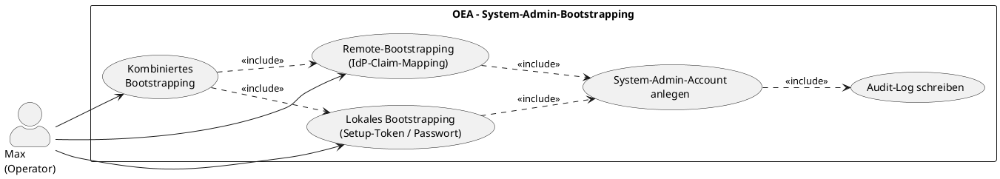

# UC-02: System-Admin-Bootstrapping

## Diagramm

## Goal in Context

Eine frisch installierte OEA-Instanz enthält weder Personen noch Rollen noch eine IdP-Konfiguration. UC-01 (Login) setzt voraus, dass bereits eine [Person](../../business-objects/person.md) mit aktiver [Role](../../business-objects/role.md) existiert – das ist bei der Erstinstallation per Definition nicht der Fall (Henne-Ei-Problem). Max muss daher einen ersten privilegierten Zugang erhalten, bevor er die Instanz für den eigentlichen Betrieb (IdP-Anbindung, erste Personen/Rollen) konfigurieren kann.

## Persona und Story

**Primärer Akteur**: [Max – Operator im KMU](../../business-analysis/stakeholders/SH-06-max-operator-kmu.md)
**Weitere Beteiligte**: [Kurt – Lead Enterprise Architekt](../../business-analysis/stakeholders/SH-03-kurt-lead-enterprise-architekt.md) – im Single-User-KMU-Szenario ist Max oft zugleich Kurt selbst

**Story**: Als Operator einer frisch installierten OEA-Instanz möchte ich einen ersten privilegierten Zugang erhalten, damit ich die Instanz konfigurieren kann, ohne dass bereits Personen oder Rollen im Repository existieren müssen.

## Trigger

- Externer Anlass: Erstinstallation einer OEA-Instanz (z.B. Container-Start)
- Zeitpunkt: einmalig pro Instanz, unmittelbar nach der Installation
- Vorgänger-Use-Case: keiner – Bootstrapping ist der Einstiegspunkt vor UC-01

## Vorbedingungen (Pre-Conditions)

- [ ] Die OEA-Instanz ist frisch installiert
- [ ] Es existiert noch kein [System-Admin-Account](../../business-objects/system-admin-account.md) für diese Instanz
- [ ] Es existieren noch keine [Person](../../business-objects/person.md)/[Role](../../business-objects/role.md)-Daten, über die ein regulärer Login (UC-01) möglich wäre

## Nachbedingungen (Post-Conditions)

### Bei Erfolg

- Ein [System-Admin-Account](../../business-objects/system-admin-account.md) existiert (lokal oder remote-gemappt, siehe [ADR-006](../../adrs/ADR-006-auth-stack-wahl.md))
- Max kann sich mit diesem Account anmelden und die Instanz weiter konfigurieren (IdP einrichten, erste Person/Role anlegen)
- Audit-Log enthält einen Eintrag über den abgeschlossenen Bootstrapping-Vorgang
- Ein erneuter Bootstrapping-Vorgang ist für diese Instanz nicht mehr möglich, ohne den bestehenden System-Admin-Account explizit zurückzusetzen (siehe E3)

### Bei Misserfolg

- Kein System-Admin-Account wird angelegt
- Die Instanz bleibt im Zustand "nicht administrierbar"
- Max erhält eine verständliche Fehlermeldung

## Hauptablauf (Basic Flow)

1. **Max**: startet die OEA-Instanz zum ersten Mal
2. **System**: erkennt, dass kein System-Admin-Account existiert, und initiiert den Bootstrapping-Vorgang (z.B. Setup-Wizard in der UI oder CLI-Kommando)
3. **Max**: wählt den Bootstrapping-Modus **lokal** (Standardfall ohne externen IdP)
4. **System**: generiert ein einmaliges Setup-Token oder fordert Max zur Festlegung eines initialen Admin-Passworts auf
5. **Max**: entnimmt das Setup-Token (z.B. aus CLI-Output/Log) bzw. setzt das initiale Passwort
6. **System**: legt den lokalen System-Admin-Account an, markiert das Bootstrapping als abgeschlossen und schreibt einen Audit-Log-Eintrag
7. **Max**: meldet sich mit dem System-Admin-Account an und beginnt mit der Weiterkonfiguration der Instanz (IdP-Anbindung, erste Person/Role)

## Alternative Abläufe (Alternative Flows)

**A1 – Remote-Bootstrapping (System-Admin über externen IdP)**: Bei Schritt 3, wenn Max den Modus **remote** wählt (siehe ADR-006):
1. Max konfiguriert den OIDC-Provider (Entra ID oder Authentik) für die Instanz
2. Max legt fest, welcher Gruppen-/Rollen-Claim des IdP System-Admin-Rechte verleiht (z.B. Entra-ID-Gruppe `oea-system-admins`)
3. System speichert dieses Mapping als [System-Admin-Account](../../business-objects/system-admin-account.md) mit `mode: remote`
4. Max meldet sich über den konfigurierten IdP an; enthält das Identity-Token den konfigurierten Claim, erhält die Session System-Admin-Rechte
- Mündet zurück in Schritt 7 des Hauptablaufs

**A2 – Kombiniertes Bootstrapping**: Max richtet zunächst lokal ein (A-Hauptablauf), konfiguriert danach zusätzlich Remote-Mapping (A1) als zweiten, parallelen Zugang
- Beide Zugänge bleiben nutzbar, bis einer davon bewusst deaktiviert wird (siehe `system-admin-account.md`, Business Rule BR-02)

## Ausnahmen / Fehlerfälle (Exception Flows)

**E1 – Setup-Token/Passwort verloren oder Vorgang abgebrochen**:
- Bedingung: Max schließt den Bootstrapping-Vorgang nicht ab oder verliert das Setup-Token vor erstem Login
- Erwartete Reaktion: Solange kein System-Admin-Account final angelegt wurde, kann der Vorgang erneut gestartet werden (zurück zu Schritt 2)
- Wiederaufnahme: Max startet den Bootstrapping-Vorgang erneut über CLI/Setup-Wizard

**E2 – Remote-Mapping zeigt auf nicht existierende oder leere Gruppe**:
- Bedingung: Der konfigurierte Claim (A1, Schritt 2) entspricht keiner tatsächlich befüllten Gruppe beim IdP
- Erwartete Reaktion: Niemand erhält über diesen Weg System-Admin-Rechte; System warnt bereits bei der Konfiguration, falls die Gruppe zum Konfigurationszeitpunkt prüfbar leer ist
- Wiederaufnahme: Max korrigiert das Mapping oder nutzt ersatzweise den lokalen Modus (Hauptablauf), um nicht ausgesperrt zu sein

**E3 – Erneuter Bootstrapping-Versuch trotz bestehendem System-Admin-Account**:
- Bedingung: Ein System-Admin-Account existiert bereits für die Instanz
- Erwartete Reaktion: System verweigert ein erneutes Bootstrapping ohne explizite Reset-Aktion durch einen bestehenden System-Admin-Account
- Wiederaufnahme: Max meldet sich mit dem bestehenden Account an und setzt das Bootstrapping bei Bedarf bewusst zurück

**E4 – Sowohl lokaler Zugang als auch Remote-Mapping nicht mehr nutzbar (vollständiger Lockout)**:
- Bedingung: Passwort/Setup-Token verloren und IdP-Mapping nicht mehr gültig (z.B. Gruppe gelöscht)
- Erwartete Reaktion: System bietet keinen regulären Self-Service-Weg zurück in die Instanz; ein dokumentiertes Recovery-Verfahren (z.B. CLI-Befehl mit Zugriff auf den Server/die Datenbank) ist nötig
- Wiederaufnahme: außerhalb des Scopes dieses Use Case (siehe "Offene Fragen")

## Datenfluss

| Schritt | Daten | Richtung | Bemerkung |
|---|---|---|---|
| 4 | Setup-Token oder initiales Passwort | System → Max | einmalig, niemals im Klartext persistiert |
| 5 | Bestätigtes Credential | Max → System | wird sofort gehasht gespeichert |
| 6 | System-Admin-Account-Datensatz | System intern | siehe [system-admin-account](../../business-objects/system-admin-account.md) |
| 6 | Audit-Log-Eintrag | System intern | Zeitpunkt, Modus (lokal/remote), Ergebnis |
| A1.2 | Claim-Mapping-Konfiguration | Max → System | provider, claimType, claimValue |

## Beteiligte Business Objects

| Business Object | Operation | Notiz |
|---|---|---|
| [system-admin-account](../../business-objects/system-admin-account.md) | create | einmalig pro Instanz im Hauptablauf, ggf. ein weiteres Mal bei A2 |

## Akzeptanzkriterien

- [ ] Hauptablauf (lokales Bootstrapping) auf einer frisch installierten Instanz vollständig durchlaufbar
- [ ] Alternative A1 (Remote-Bootstrapping über Entra ID oder Authentik) funktioniert
- [ ] Alternative A2 (kombiniertes Bootstrapping) erlaubt beide Zugänge parallel
- [ ] Ein zweiter Bootstrapping-Versuch wird abgelehnt, solange ein System-Admin-Account existiert (E3)
- [ ] Fehlerfälle E1–E4 sind dokumentiert behandelt; E4 verweist auf ein gesondertes Recovery-Verfahren
- [ ] Audit-Log enthält einen Eintrag über den abgeschlossenen Bootstrapping-Vorgang inkl. gewähltem Modus
- [ ] Nach erfolgreichem Bootstrapping ist ein regulärer Login gemäß UC-01 für weitere Personen möglich, sobald diese mit Rolle angelegt wurden

Eine instanzweite Erzwingung eines zweiten Faktors für reguläre Personen (siehe [REQ-020](../req/REQ-020-erzwingung-zweiter-faktor.md), UC-01) gilt explizit **nicht** für den System-Admin-Account: Bootstrapping muss auch dann funktionieren, wenn der Betreiber 2FA für reguläre Personen erzwungen hat, da der System-Admin-Account außerhalb des regulären Person-/Role-Modells steht und über eigene Mechanismen (REQ-017, sichere Setup-Token-Übergabe) abgesichert ist.

## Nicht im Scope

- Reguläre Anmeldung bestehender Personen mit Rolle (siehe UC-01)
- Anlegen der ersten fachlichen Person/Role-Datensätze im Repository (eigener, nachfolgender Use Case)
- Vollständiges Recovery-/Break-Glass-Verfahren bei komplettem Lockout (E4) – nur als offene Frage vermerkt
- Verwaltung mehrerer gleichzeitiger System-Admin-Accounts über das Minimum hinaus (A2 deckt den einfachen Fall ab, kein vollständiges Admin-Management)

## Konzept-Bezüge

- [§21.8 Sicherheit und Autorisierung](../../concept/70-platform/21-api-architektur.md)

## Realisierungs-Hinweise

- EntityTypes: `SystemAdminAccount` (siehe `system-admin-account.md`) – bewusst kein EA-Metamodell-Entity
- Setup-Token-Übergabe sollte über einen Kanal erfolgen, auf den nur der Operator Zugriff hat (CLI-Output beim ersten Start, nicht über die Web-UI ohne vorherige Authentifizierung)
- Erkennung "kein System-Admin-Account vorhanden" muss robust gegen Race Conditions sein (BR-01 aus `system-admin-account.md`: kein paralleles Bootstrapping)
- Lokaler System-Admin-Account sollte gemäß ADR-006-Folgeentscheidung deaktivierbar sein, sobald Remote-Mapping aktiv ist

## Realisierende Bestandteile

- Requirements: [REQ-013](../req/REQ-013-lokales-bootstrapping.md), [REQ-014](../req/REQ-014-remote-bootstrapping.md), [REQ-015](../req/REQ-015-kein-paralleles-bootstrapping.md), [REQ-016](../req/REQ-016-audit-log-bootstrapping.md), [REQ-017](../req/REQ-017-sichere-setup-token-uebergabe.md), [REQ-018](../req/REQ-018-warnung-leerer-admin-claim.md), [REQ-019](../req/REQ-019-deaktivierbarkeit-lokaler-admin.md)
- User Stories: [US-013](../user-stories/US-013-lokales-bootstrapping.md), [US-014](../user-stories/US-014-remote-bootstrapping.md), [US-015](../user-stories/US-015-kein-paralleles-bootstrapping.md), [US-016](../user-stories/US-016-audit-log-bootstrapping.md), [US-017](../user-stories/US-017-sichere-setup-token-uebergabe.md), [US-018](../user-stories/US-018-warnung-leerer-admin-claim.md), [US-019](../user-stories/US-019-deaktivierbarkeit-lokaler-admin.md)
- ADRs: [ADR-006](../../adrs/ADR-006-auth-stack-wahl.md)
- Test Cases: noch keine
- Implementation: noch keine

## Offene Fragen

- [ ] Wie wird das initiale Setup-Token sicher übergeben (CLI-Stdout, temporäre Datei, einmalige Setup-URL)?
- [ ] Wie sieht das Recovery-/Break-Glass-Verfahren bei vollständigem Lockout (E4) konkret aus – z.B. ein CLI-Befehl mit direktem Datenbankzugriff?
- [x] Soll die Instanz beim Start aktiv warnen/blockieren, wenn der lokale System-Admin-Account trotz aktivem Remote-Mapping nicht deaktiviert wurde? → [REQ-019](../req/REQ-019-deaktivierbarkeit-lokaler-admin.md): deaktivierbar, aber kein Zwang (Operator-Entscheidung)
- [x] Wie wird geprüft, ob eine konfigurierte IdP-Gruppe (A1) zum Konfigurationszeitpunkt tatsächlich befüllt ist? → [REQ-018](../req/REQ-018-warnung-leerer-admin-claim.md): Best-Effort-Warnung, kein Hard-Block

## Notizen

UC-02 löst die in [ADR-006](../../adrs/ADR-006-auth-stack-wahl.md) als Folgeentscheidung benannte Lücke: UC-01 (Login) setzt bereits existierende Person-/Role-Daten voraus und kann daher das Henne-Ei-Problem der Erstinstallation nicht lösen. Primärer Akteur ist SH-06 (Max), weil Bootstrapping eine Operator-Tätigkeit ist, nicht die einer EA-Persona – auch wenn im Single-User-KMU-Fall (SH-03 Kurt) beide Rollen in derselben Person zusammenfallen.

## Änderungshistorie

| Version | Datum | Autor | Änderung |
|---|---|---|---|
| 0.1.0 | 2026-06-24 | Requirements Engineer | Initial draft, löst Folgeentscheidung aus ADR-006 |
