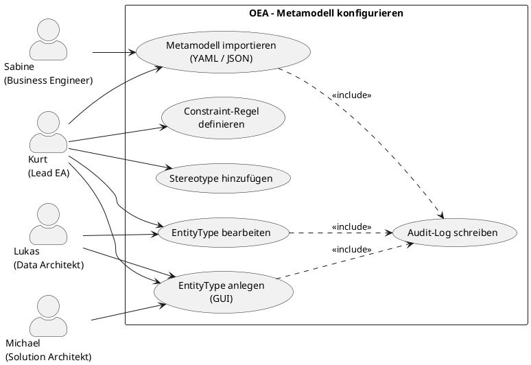

# UC-04: Metamodell gemeinsam konfigurieren

## Diagramm

## Goal in Context

Bevor Architekten Entitäten im Repository erfassen können, muss das Architekturteam festlegen, welche Typen von Entitäten und Relationen in ihrer Organisation überhaupt modellierbar sind. OEA liefert ein TOGAF-basiertes Kern-Metamodell (§6), das jedoch organisations-spezifisch erweitert werden muss: Branchen-Besonderheiten, proprietäre Plattform-Typen oder interne Governance-Anforderungen erfordern Custom EntityTypes, Stereotypen und Constraint-Regeln. Dieser Use Case ermöglicht dem Architekturteam, diese Konfiguration gemeinsam, iterativ und ohne Code-Deployment vorzunehmen – entweder über das GUI oder per Datei-Import.

## Persona und Story

**Primärer Akteur**: [Kurt – Lead Enterprise Architekt](../../business-analysis/stakeholders/SH-03-kurt-lead-enterprise-architekt.md)
**Weitere Beteiligte**: [Lukas – Senior Data Architekt](../../business-analysis/stakeholders/SH-02-lukas-senior-data-architekt.md), [Michael – Solution Architekt](../../business-analysis/stakeholders/SH-04-michael-solution-architekt.md), [Sabine – Business Engineer](../../business-analysis/stakeholders/SH-07-sabine-business-engineer.md)

**Story**: Als Lead Enterprise Architekt möchte ich gemeinsam mit meinem Architekturteam das Metamodell unserer Organisation konfigurieren, damit alle Architekten Entitäten nach einem einheitlichen, organisation-spezifischen Schema erfassen können.

## Trigger

- Ersteinrichtung einer OEA-Instanz: das TOGAF-Kern-Metamodell muss organisations-spezifisch erweitert werden
- Neue Anforderungen (z.B. ISO 27001 führt `SecurityZone` als notwendigen Typ ein)
- Import eines vorbereiteten Metamodells aus einem externen Tool oder einer Vorlage
- Iteration: bestehender EntityType wird um Properties erweitert; neuer Stereotype wird hinzugefügt

## Vorbedingungen (Pre-Conditions)

- [ ] Kurt ist eingeloggt (UC-01) und hat die Rolle „Metamodell-Bearbeiter" oder eine Rolle mit entsprechender Berechtigung
- [ ] Eine OEA-Instanz existiert mit einer initialen (ggf. leeren) [MetamodelConfiguration](../../business-objects/metamodel-configuration.md)
- [ ] Das TOGAF-Kern-Metamodell (built-in EntityTypes, §6) ist immer vorhanden und sichtbar

## Nachbedingungen (Post-Conditions)

### Bei Erfolg

- Die [MetamodelConfiguration](../../business-objects/metamodel-configuration.md) der Instanz ist um den neuen/geänderten Eintrag aktualisiert
- `lastModifiedBy` und `lastModifiedAt` sind auf Kurt gesetzt
- Audit-Log-Eintrag: Person-ID, Zeitpunkt, Art der Änderung (create/update/delete EntityType/Stereotype/Constraint), betroffenes Element
- Die neue Konfiguration ist sofort wirksam: bei der Anlage neuer Entitäten stehen die neuen Typen zur Verfügung

### Bei Misserfolg

- Konfiguration bleibt unverändert
- Fehler mit konkreter Meldung (z.B. „Name 'ApplicationComponent' bereits vergeben (built-in)")

## Hauptablauf (Basic Flow)

*Standardfall: Kurt erstellt einen neuen Custom EntityType via GUI*

1. **Kurt**: navigiert zur Metamodell-Konfiguration (Admin- oder Architektur-Bereich)
2. **System**: zeigt alle EntityTypes (built-in + custom) in einer übersichtlichen Liste; built-in als schreibgeschützt markiert
3. **Kurt**: klickt „Neuer EntityType"
4. **System**: öffnet ein Formular mit Feldern: Name (PascalCase), optionaler Basis-Typ (Dropdown aus bestehenden Typen), Beschreibung
5. **Kurt**: füllt das Formular aus (z.B. Name: `SecurityZone`, Basis-Typ: keiner, Beschreibung: „Logische Netzwerkzone mit Trust-Level")
6. **Kurt**: fügt Properties hinzu (Name, Typ, Pflichtfeld ja/nein; bei Enum: Werte angeben); fügt Relationen hinzu (Ziel-Typ, Kardinalität)
7. **Kurt**: speichert
8. **System**: validiert (Name eindeutig, Basis-Typ gültig, Kardinalitäts-Format korrekt); bei Erfolg persistiert es den neuen EntityType, schreibt Audit-Log, zeigt Bestätigung

## Alternative Abläufe (Alternative Flows)

**A1 – Import aus Datei**:
Wenn Kurt eine bestehende Metamodell-Definition als Datei vorliegen hat:
1. Kurt wählt „Import"
2. System zeigt Import-Dialog mit Formatauswahl (YAML, JSON)
3. Kurt lädt die Datei hoch
4. System parst und validiert die Datei: prüft Schema-Konformität, Namens-Konflikte mit bestehenden Typen, Referenz-Integrität (jeder `extends`-Wert muss ein gültiger Typ sein)
5. System zeigt eine Vorschau: neu hinzukommende Typen (grün), Konflikte (rot)
6. Kurt bestätigt oder bricht ab
7. Bei Bestätigung: System importiert alle konfliktfreien Typen; Audit-Log-Eintrag für jeden importierten Eintrag

**A2 – Stereotype hinzufügen**:
1. Kurt wählt einen bestehenden EntityType (built-in oder custom)
2. Kurt wählt „Stereotype hinzufügen"
3. Formular: Stereotype-Name (PascalCase), zusätzliche Properties
4. System speichert den Stereotype und verknüpft ihn mit dem Basis-Typ

**A3 – Constraint-Regel definieren**:
1. Kurt wählt einen EntityType und öffnet „Constraint-Regeln"
2. Kurt definiert: Regelname, Ausdruck (Rule Expression), Schweregrad (hint/warning/error), Fehlermeldung
3. System speichert die Regel; sie wird bei der nächsten Validierung angewendet

**A4 – Bestehender EntityType bearbeiten**:
Nur Custom EntityTypes (nicht built-in) können bearbeitet werden:
1. Kurt wählt den EntityType
2. Kurt ändert Beschreibung, Properties oder Relationen
3. System prüft, ob bestehende Entitäten durch die Änderung invalide würden (z.B. Pflichtfeld hinzugefügt → Warnung, keine Blockierung)
4. System speichert und schreibt Audit-Log

**A5 – Anderer Architekt nimmt Änderungen vor**:
Lukas (SH-02) hat ebenfalls die Metamodell-Bearbeiter-Rolle:
- Identischer Ablauf wie Hauptablauf oder A1–A4
- Alle Änderungen sind Lukas im Audit-Log zugeordnet
- Gleichzeitige Bearbeitung desselben EntityTypes: Last-Write-Wins mit Warnung bei Kollision (optimistic locking)

## Ausnahmen / Fehlerfälle (Exception Flows)

**E1 – Name bereits vergeben**:
- Bedingung: Kurt versucht, einen EntityType mit einem Namen anzulegen, der bereits existiert (built-in oder custom)
- Erwartete Reaktion: Validierungsfehler „Name 'X' ist bereits vergeben (built-in/custom)"; Formular bleibt offen
- Wiederaufnahme: Kurt wählt einen anderen Namen

**E2 – Basis-Typ nicht existent**:
- Bedingung: Beim Import enthält eine `extends`-Referenz einen unbekannten Typ
- Erwartete Reaktion: Import-Vorschau markiert den Eintrag als Fehler; Import-Bestätigung ohne Auflösung dieses Konflikts nicht möglich
- Wiederaufnahme: Kurt korrigiert die Datei oder importiert ohne die fehlerhaften Einträge (partial import)

**E3 – Custom EntityType wird von bestehenden Entitäten genutzt**:
- Bedingung: Kurt versucht, einen Custom EntityType zu löschen, dem noch Entitäten im Repository zugeordnet sind
- Erwartete Reaktion: Fehlermeldung mit Anzahl der betroffenen Entitäten; Löschen blockiert
- Wiederaufnahme: Kurt löscht zuerst die betroffenen Entitäten oder archiviert sie

**E4 – Fehlende Berechtigung**:
- Bedingung: Eine Person ohne Metamodell-Bearbeiter-Rolle versucht, eine Änderung vorzunehmen
- Erwartete Reaktion: 403 Forbidden; Audit-Log-Eintrag für unbefugten Zugriffsversuch
- Wiederaufnahme: Kein Zugriff; Person wendet sich an Admin

## Datenfluss

| Schritt | Daten | Richtung | Bemerkung |
|---|---|---|---|
| 2 | EntityType-Liste (built-in + custom) | System → Kurt | Built-in als read-only markiert |
| 5–6 | EntityType-Definition (Name, Properties, Relations) | Kurt → System | |
| 8 | Validierungsergebnis, persistierte Konfiguration | System intern | |
| A1.3 | YAML/JSON-Datei | Kurt → System | Max. Dateigröße TBD |
| A1.5 | Import-Vorschau (Diff) | System → Kurt | |

## Beteiligte Business Objects

| Business Object | Operation | Notiz |
|---|---|---|
| [metamodel-configuration](../../business-objects/metamodel-configuration.md) | read, update | Kern-Objekt: EntityTypeDefinitions, Stereotypes, ConstraintRules |
| [person](../../business-objects/person.md) | read | Authentifizierung; `lastModifiedBy` referenziert Person |
| [role](../../business-objects/role.md) | read | Berechtigungsprüfung: Metamodell-Bearbeiter-Rolle |

## Akzeptanzkriterien

- [ ] Hauptablauf: Neuer Custom EntityType (mit Properties und Relations) über GUI anlegbar
- [ ] Built-in EntityTypes sind sichtbar aber nicht löschbar/veränderbar (E1, BR-02)
- [ ] A1: YAML-Import mit Vorschau-Diff funktioniert; Konflikte werden erkannt und angezeigt
- [ ] A2: Stereotype auf bestehenden Typ hinzufügbar
- [ ] A3: Constraint-Regel mit Schweregrad definierbar; bei Severity=error blockiert sie das Speichern ungültiger Entitäten
- [ ] A4: Custom EntityType editierbar; Warnung bei potentiell brechenden Änderungen
- [ ] A5: Mehrere Architekten mit Metamodell-Bearbeiter-Rolle können Änderungen vornehmen; Audit-Log weist jede Änderung der richtigen Person zu
- [ ] E1: Namenskollision mit konkreter Fehlermeldung abgelehnt
- [ ] E3: Löschen eines belegten EntityTypes blockiert; Anzahl betroffener Entitäten angezeigt
- [ ] Audit-Log enthält nach jeder Änderung: Person-ID, Zeitpunkt, Änderungsart, betroffenes Element

## Nicht im Scope

- Real-Time Collaborative Editing (gleichzeitiges Tippen mehrerer Personen in dasselbe Formular); Last-Write-Wins mit Kollisionswarnung ist ausreichend (A5)
- ArchiMate-XMI-Import (gesonderte Entscheidung; YAML/JSON ist der primäre Import-Pfad)
- Versionierung/Rollback der Metamodell-Konfiguration (separater Use Case)
- Metamodell-Export (separater Use Case)
- Validierung bestehender Entitäten beim Hinzufügen einer neuen Constraint-Regel (Batch-Validierung ist separater Use Case)
- Migration bestehender Entitäten bei Breaking Changes (§15 Schema-Evolution ist separater Mechanismus)

## Konzept-Bezüge

- [§6 Kern-Entitätstypen](../../concept/20-entities/06-kern-entitaetstypen.md)
- [§14 Erweiterbarkeit – Custom EntityTypes, Stereotypes, Constraint-Regeln](../../concept/40-extensibility/14-erweiterbarkeit.md)
- [§15 Schema-Evolution](../../concept/40-extensibility/15-schema-evolution.md)

## Realisierungs-Hinweise

- Built-in EntityTypes: im Backend als Code-Konstante (nicht in DB) verwaltet; API gibt sie gemeinsam mit Custom-Typen zurück (union)
- Optimistic Locking: `MetamodelConfiguration.schemaVersion` bei jeder Änderung inkrementieren; Konflikt erkannt, wenn Version bei Speichern abweicht
- Import-Validierung: separate Funktion (Input: Datei-Inhalt → Output: Diff-Liste + Fehler-Liste); transaktionaler Import (alle oder nichts, oder partial mit expliziter Nutzer-Wahl)
- Rule Expression für ConstraintRules: zunächst einfache Property-Null-Checks (MVP); komplexere Ausdrücke (cross-entity) als Erweiterung

## Realisierende Bestandteile

- Requirements: [REQ-032](../req/REQ-032-entitytype-gui-konfiguration.md), [REQ-033](../req/REQ-033-metamodell-import.md), [REQ-034](../req/REQ-034-audit-log-metamodell.md)
- User Stories: [US-032](../user-stories/US-032-entitytype-anlegen.md), [US-033](../user-stories/US-033-metamodell-importieren.md), [US-034](../user-stories/US-034-audit-log-metamodell.md)
- ADRs: –
- Test Cases: noch keine
- Implementation: noch keine

## Offene Fragen

- [ ] Welche Rolle berechtigt zur Metamodell-Bearbeitung? Separate „Metamodell-Bearbeiter"-Rolle oder Eigenschaft der „Lead-Architekt"-Rolle?
- [ ] Partial Import: Soll der Nutzer wählen können, welche Einträge aus einer konfliktbehafteten Datei importiert werden (Checkbox pro Eintrag), oder ist es alles-oder-nichts?
- [ ] Constraint-Ausdruck-Sprache: Welche Syntax für Rule Expressions? Eigene DSL, JSONPath, oder CEL (Common Expression Language)?

## Notizen

UC-04 ist bewusst auf `target_release: v1.0` gesetzt (nicht Walking Skeleton), da die Metamodell-Konfiguration zwar früh benötigt wird, aber im Walking Skeleton noch durch statische Konfiguration überbrückt werden kann. Der Walking Skeleton arbeitet mit den built-in TOGAF-Typen ohne Custom EntityTypes.

## Änderungshistorie

| Version | Datum | Autor | Änderung |
|---|---|---|---|
| 0.1.0 | 2026-06-25 | Requirements Engineer | Initial draft |
