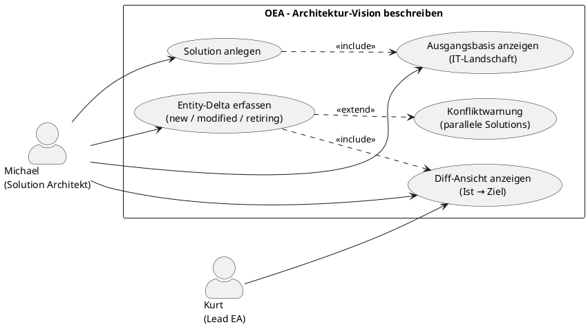

# UC-05: Architektur-Vision einer Änderungsinitiative beschreiben

## Diagramm

## Goal in Context

Wenn ein Unternehmen eine bestehende Lösung erweitern oder verändern will – ein neues Modul einführen, eine Schnittstelle ablösen, eine Plattform migrieren –, muss der Solution Architekt frühzeitig klären: Was ist der genaue Scope dieser Initiative? Welche Systemteile sind betroffen, welche nicht? Welcher Zielzustand soll erreicht werden?

OEA löst dieses Problem, indem der Solution Architekt für eine Änderungsinitiative eine **Solution** anlegt und darin die **Architektur-Vision** beschreibt: den aktuellen Stand der betroffenen Systemlandschaft sowie die geplanten Änderungen (neue Entitäten, Modifikationen, Ausserbetriebnahmen). Das Ergebnis ist eine maschinenlesbare Scope-Abgrenzung, die als Grundlage für Reviews, Freigaben und Go-Live-Entscheidungen dient.

## Persona und Story

**Primärer Akteur**: [Michael – Solution Architekt](../../business-analysis/stakeholders/SH-04-michael-solution-architekt.md)
**Weitere Beteiligte**: [Kurt – Lead Enterprise Architekt](../../business-analysis/stakeholders/SH-03-kurt-lead-enterprise-architekt.md) (Freigabe, nicht Teil dieses UC)

**Story**: Als Solution Architekt möchte ich für eine geplante Änderungsinitiative eine Architektur anlegen, in der ich den aktuellen Stand der betroffenen Systeme abbilde und die geplanten Änderungen beschreibe – damit der Scope klar abgegrenzt ist, alle Beteiligten dasselbe Bild haben und ein Review möglich ist.

## Trigger

- Ein Projekt oder eine Initiative ist geplant, die bestehende Systeme erweitert, ablöst oder neu einführt
- Michael wird beauftragt, die Architektur einer konkreten Lösung zu beschreiben
- Eine bestehende Solution-Draft soll inhaltlich ausgearbeitet werden (Scope noch unklar)

## Vorbedingungen (Pre-Conditions)

- [ ] Michael ist eingeloggt (UC-01) und hat die Rolle „Solution-Architekt" oder eine Rolle mit entsprechender Berechtigung
- [ ] Im Projekt-Modus: mindestens ein grundlegendes Verständnis der bestehenden IT-Landschaft liegt vor (implemented-Solutions oder manuelle Basisdaten)
- [ ] Im Plateau-Modus (Alternative A1): ein Baseline-Plateau mit status=`baseline` existiert

## Nachbedingungen (Post-Conditions)

### Bei Erfolg

- Eine [Solution](../../business-objects/solution.md) existiert mit status=`draft`
- Die Solution enthält einen Architecture-Vision-Text (Name + Beschreibung: Ziel, Scope, Begründung)
- Alle EntityDeltas sind erfasst (deltaType=`new`, `modified` oder `retiring`)
- Die Diff-Ansicht zeigt den aktuellen Stand (betroffene Entitäten aus der Landschaft) dem Zielzustand (nach Anwendung der Deltas) gegenüber
- `ownerId` der Solution ist auf Michael gesetzt; `createdAt` und `createdBy` sind gesetzt

### Bei Misserfolg

- Kein neues Objekt wurde persistiert (oder bestehendes bleibt unverändert)
- Fehlermeldung mit konkretem Hinweis (z.B. fehlende Berechtigung, Validierungsfehler)

## Hauptablauf (Basic Flow)

*Standardfall: Michael legt eine neue Solution an und beschreibt die Architektur-Vision im Projekt-Modus (KMU)*

1. **Michael**: navigiert zur Solution-Übersicht
2. **System**: zeigt alle bestehenden Solutions mit Status und Owner
3. **Michael**: klickt „Neue Solution anlegen"
4. **System**: öffnet ein Erstellungsformular mit Feldern:
   - Name (z.B. „ERP-Erweiterung Modul Logistics")
   - Beschreibung / Architektur-Vision (Freitext: Ziel der Initiative, was und warum verändert wird)
5. **Michael**: füllt das Formular aus und speichert
6. **System**: legt die Solution im Status `draft` an; Michael ist `ownerId`
7. **System**: zeigt die Solution-Detailansicht; Bereich „Architektur-Vision & Scope"
8. **System**: zeigt den **aktuellen Stand** der IT-Landschaft als Ausgangsbasis:
   - Projekt-Modus: alle Entitäten aus `implemented`-Solutions, aggregiert nach der Entity-ID
   - Suchbar, filterbar nach Entitätstyp und Name
9. **Michael**: identifiziert die betroffenen Entitäten und erfasst die **geplanten Änderungen** als EntityDeltas:
   - a. **Entität wird modifiziert**: Michael wählt eine bestehende Entität → „Änderung erfassen" → beschreibt geänderte Properties → `deltaType=modified`
   - b. **Entität geht ausser Betrieb**: Michael wählt eine bestehende Entität → „Ausser Betrieb nehmen" → `deltaType=retiring`
   - c. **Neue Entität entsteht**: Michael klickt „Neue Entität" → gibt Typ, Name und Properties an → `deltaType=new`
10. **System**: aktualisiert nach jedem Delta die **Diff-Ansicht** in Echtzeit:
    - Links/Oben: betroffene Entitäten im aktuellen Stand (aus der Landschaft)
    - Rechts/Unten: Zielzustand nach Anwendung der Deltas (retiring ausgegraut, modified mit Änderung, new hervorgehoben)
11. **Michael**: prüft die Diff-Ansicht; der Scope der Initiative ist klar abgegrenzt
12. **Michael**: speichert abschliessend → Architecture Vision ist vollständig erfasst; Solution verbleibt im Status `draft`

## Alternative Abläufe (Alternative Flows)

**A1 – Plateau-Modus (Enterprise)**:
Wenn die Instanz im Plateau-Modus arbeitet:
1. Schritt 4: Formular enthält zusätzlich die Felder `fromPlateau` (Dropdown: bestehende Plateaus mit status=`baseline`) und `toPlateau` (Dropdown: Plateaus mit status=`target`; oder „Neues Ziel-Plateau anlegen")
2. Schritt 8: System zeigt als aktuellen Stand die Entitäten des `fromPlateau` (inkl. aller geerbten Entitäten)
3. EntityDeltas beschreiben den Delta vom Baseline- zum Target-Plateau
4. Ansonsten identischer Ablauf

**A2 – Bestehende Solution-Draft weiterbearbeiten**:
Wenn für die Initiative bereits eine Solution-Draft angelegt wurde, aber der Scope noch nicht ausgearbeitet ist:
1. Michael öffnet die bestehende Solution über die Solution-Übersicht
2. Weiter mit Schritt 7 des Hauptablaufs

**A3 – Entitäten aus aktueller Landschaft direkt in Scope aufnehmen**:
Wenn viele Entitäten betroffen sind:
1. Michael wählt in Schritt 8 mehrere Entitäten per Mehrfachauswahl
2. Michael wählt für die Gesamtauswahl den Delta-Typ (z.B. alle als `modified` vormarkieren)
3. Michael verfeinert danach jeden Delta einzeln
4. System validiert und übernimmt alle Deltas

## Ausnahmen / Fehlerfälle (Exception Flows)

**E1 – EntityDelta-Konflikt mit paralleler Solution**:
- Bedingung: Eine andere Solution (status≠`implemented`, ≠`archived`) enthält bereits ein EntityDelta für dieselbe Entität
- Erwartete Reaktion: System zeigt Warnung mit Verweis auf die konkurrierende Solution und deren Owner; Erfassen des Deltas ist dennoch möglich
- Wiederaufnahme: Auflösung erfolgt im Review-Prozess; Michael kann den Conflict-Hinweis im Delta vermerken

**E2 – Leere Landschaft (Projekt-Modus, noch keine implemented-Solutions)**:
- Bedingung: Im Projekt-Modus existieren noch keine `implemented`-Solutions → die aggregierte Landschaft ist leer
- Erwartete Reaktion: System zeigt einen Hinweis „Die Landschaft enthält noch keine realisierten Entitäten. Du kannst ausschliesslich neue Entitäten anlegen (deltaType=new)."; Felder für `modified` und `retiring` sind deaktiviert
- Wiederaufnahme: Michael legt ausschliesslich neue Entitäten an

**E3 – Entität im aktuellen Stand nicht auffindbar**:
- Bedingung: Michael sucht nach einer Entität, die in der Landschaft nicht vorhanden ist (z.B. noch nicht in OEA erfasst)
- Erwartete Reaktion: Suchergebnis leer; System schlägt vor, die Entität als `deltaType=new` anzulegen oder zunächst im Basisdatenbestand zu erfassen
- Wiederaufnahme: Michael legt sie als neue Entität an oder bricht ab und klärt, ob die Entität erst importiert werden muss

**E4 – Fehlende Berechtigung**:
- Bedingung: Michael hat nicht die Rolle „Solution-Architekt" oder eine vergleichbare Berechtigung
- Erwartete Reaktion: 403 Forbidden mit konkreter Fehlermeldung; kein Datenzugriff
- Wiederaufnahme: Michael wendet sich an Admin (UC-02)

## Datenfluss

| Schritt | Daten | Richtung | Bemerkung |
|---|---|---|---|
| 4–5 | Name, Beschreibung (Architecture-Vision-Text) | Michael → System | Freitext; keine Struktur erzwungen |
| 8 | Entitätsliste des aktuellen Stands | System → Michael | Aggregiert aus implemented-Solutions (Projekt) oder fromPlateau (Plateau) |
| 9a–c | EntityDelta (entityId, deltaType, changes) | Michael → System | Werteobjekt; kein eigenes BO |
| 10 | Diff-Ansicht (aktueller Stand vs. Zielzustand) | System → Michael | Liveberechnung; nicht persistiert |
| 12 | Solution (status=draft, mit Deltas) | System intern | Persistiert |

## Beteiligte Business Objects

| Business Object | Operation | Notiz |
|---|---|---|
| [solution](../../business-objects/solution.md) | create, update | Kern-Objekt: Name, Beschreibung, EntityDeltas, status=draft |
| [architecture](../../business-objects/architecture.md) | read | Domänenmodell-Übersicht; Entitätsliste für Ausgangsbasis |
| [person](../../business-objects/person.md) | read | Authentifizierung; `ownerId` und `createdBy` |
| [role](../../business-objects/role.md) | read | Berechtigungsprüfung: Solution-Architekt-Rolle |

## Akzeptanzkriterien

- [ ] Solution mit Name und Architecture-Vision-Text (Beschreibung) anlegbar
- [ ] Aktueller Stand der Landschaft wird als Ausgangsbasis angezeigt: Projekt-Modus = Summe aller `implemented`-Solutions; Plateau-Modus = Entitäten des `fromPlateau`
- [ ] EntityDeltas aller drei Typen (`new`, `modified`, `retiring`) sind erfassbar
- [ ] Diff-Ansicht zeigt betroffene Entitäten: aktueller Stand links/oben, Zielzustand rechts/unten; Änderungen visuell unterscheidbar
- [ ] E1: Bei überschneidendem EntityDelta mit einer anderen Solution erscheint eine Warnung (nicht blockierend)
- [ ] E2: Bei leerer Landschaft erscheint ein erklärender Hinweis; `modified` und `retiring` sind deaktiviert
- [ ] A1: Im Plateau-Modus dienen Entitäten des `fromPlateau` als Ausgangsbasis; `toPlateauId` ist wählbar
- [ ] E4: Zugriff ohne Berechtigung wird mit 403 abgelehnt; kein Datenleck

## Nicht im Scope

- **Status-Übergänge der Solution** (draft → proposed → approved → in-progress): das ist ein Review- und Freigabeprozess; separater Use Case
- **Go-Live-Prozess** (Solution als `implemented` abschließen, Plateau-Übergang auslösen): künftiger UC (Nummer TBD)
- **Plateau anlegen und verwalten**: künftiger UC (Nummer TBD)
- **Metamodell-Erweiterung auf Solution-Scope** (Custom EntityTypes nur für diese Solution): UC-04 / REQ-037
- **Solution löschen oder archivieren**: separater UC oder Admin-Funktion
- **Kollisions-Auflösung bei parallelen Solutions**: Review-Prozess (nach diesem UC)
- **XMI/Sparx-Import** (Entitäten aus bestehenden Modellen importieren): eigene Integrationskomponente (§§ Integrations-Kapitel)
- **Diagramm-Ausgabe der Diff-Ansicht**: Visualisierungs-UC; die Diff-Ansicht hier ist funktional, nicht final gestaltet

## Konzept-Bezüge

- [§6 Kern-Entitätstypen](../../concept/20-entities/06-kern-entitaetstypen.md) – EntityTypes die in Deltas verwendet werden
- [§11 Temporales Modell](../../concept/20-entities/11-temporales-modell.md) – Aktueller Stand vs. Zielzustand; Plateau-Zeitfenster
- [§12 Domain-Sichten](../../concept/20-entities/12-domain-sichten.md) – Scope-Abgrenzung als Domain-View-Konzept
- [§16 Beispiel-Walkthrough](../../concept/50-walkthrough/16-beispiel-walkthrough.md) – End-to-End-Beispiel mit Solution und EntityDeltas

## Realisierungs-Hinweise

- Diff-Berechnung: zustandslos, serverseitig berechnet aus `EntityDelta[]` + Landschafts-Snapshot; nicht persistiert
- EntityDelta-Konflikt-Erkennung: bei jeder Delta-Speicherung prüfen, ob eine andere nicht-archivierte Solution ein Delta für dieselbe `entityId` enthält; nur Warnung, kein Block
- Aggregierter Ist-Stand (Projekt-Modus): `SELECT DISTINCT entity_id FROM entity_deltas WHERE solution.status = 'implemented'`; bei mehrfachem `modified`-Delta auf dieselbe Entität gilt der zuletzt implementierte Stand
- Projekt-Modus und Plateau-Modus sollten über denselben UI-Flow bedient werden; Plateau-Felder werden nur eingeblendet wenn die Instanz im Plateau-Modus konfiguriert ist

## Realisierende Bestandteile

- Requirements: [REQ-038](../req/REQ-038-solution-anlegen.md), [REQ-039](../req/REQ-039-landschaft-ausgangsbasis.md), [REQ-040](../req/REQ-040-entity-deltas-erfassen.md), [REQ-041](../req/REQ-041-diff-ansicht.md), [REQ-042](../req/REQ-042-konflikt-warnung-parallele-solutions.md)
- User Stories: [US-038](../user-stories/US-038-solution-anlegen.md), [US-039](../user-stories/US-039-landschaft-ausgangsbasis-anzeigen.md), [US-040](../user-stories/US-040-delta-neue-entitaet.md), [US-041](../user-stories/US-041-delta-modified.md), [US-042](../user-stories/US-042-delta-retiring.md), [US-043](../user-stories/US-043-diff-ansicht.md), [US-044](../user-stories/US-044-konflikt-warnung.md)
- ADRs: –
- Test Cases: noch keine
- Implementation: noch keine

## Offene Fragen

- [ ] Wie wird der „aktuelle Stand" beim ersten Aufruf berechnet, wenn Entitäten noch nicht in OEA modelliert sind, sondern nur in Sparx oder einem anderen Tool vorliegen? (Abhängigkeit: Import-UC / XMI-Integration)
- [ ] Soll die Diff-Ansicht exportierbar sein (z.B. als PDF oder Markdown für Stakeholder-Präsentationen)? Oder ist das ein separater Export-UC?
- [ ] Braucht jedes EntityDelta eine optionale Begründung (Freitext „Warum diese Änderung?")? Das wäre wertvoll für Reviews, aber erhöht den Erfassungsaufwand.
- [ ] Soll `deltaType=modified` die vorherigen Property-Werte automatisch aus der Landschaft vorbelegen (Before-State), oder gibt Michael beide Zustände manuell ein?

## Notizen

UC-05 ist bewusst auf den Erfassungs-Workflow begrenzt: Solution anlegen, Architecture Vision beschreiben, EntityDeltas erfassen. Der anschliessende Review-/Freigabe-Workflow (proposed → approved) und der Go-Live-Prozess (implemented + Plateau-Übergang) sind separate Use Cases, da sie eigene Akteure (Lead EA, Betreiber) und Entscheidungsschritte involvieren.

Der Projekt-Modus (KMU) ist der Hauptablauf, weil er der einfachere Einstieg ist und die grössere Zielgruppe anspricht. Der Plateau-Modus ist Alternative A1, setzt aber auf denselben technischen Mechanismus (EntityDelta); nur der Ausgangspunkt der Landschaft ist unterschiedlich.

## Änderungshistorie

| Version | Datum | Autor | Änderung |
|---|---|---|---|
| 0.1.0 | 2026-06-26 | Requirements Engineer | Initial draft |
