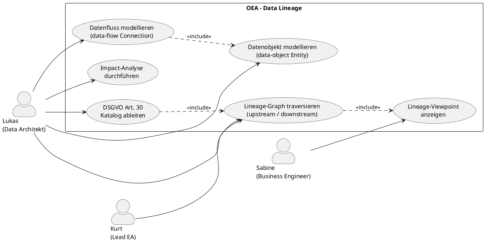

# UC-08: Datenflusskarte (Data Lineage) modellieren und analysieren

## Diagramm



## Goal in Context

In jedem Unternehmen fliessen Daten zwischen Systemen: Kundenstammdaten aus dem ERP in das CRM, Transaktionsdaten aus Kassensystemen in das Data Warehouse, Personalstammdaten aus dem HR-System in die Abrechnung. Diese Flüsse sind selten vollständig dokumentiert, veralten schnell nach Schemaänderungen und sind für Fachabteilungen, Datenschutzbeauftragte und Auditoren kaum nachvollziehbar.

OEA löst dieses Problem, indem Datenobjekte und Datenflüsse als First-Class-Entitäten im selben Architekturmodell geführt werden wie Anwendungskomponenten. Jeder Datenfluss referenziert explizit, welche Datenobjekte er transportiert. Das Ergebnis ist ein **traversierbarer Lineage-Graph**: OEA kann zu einem beliebigen Datenobjekt alle Quell- und Zielsysteme (upstream / downstream) berechnen – nicht nur als Diagramm, sondern als abfragbare API-Antwort.

Dieser UC ist die Grundlage für:
- **DSGVO Art. 30**: Verarbeitungsverzeichnis aus dem Modell generieren (Nebenfluss A3)
- **Impact Analysis**: welche Systeme sind betroffen, wenn sich das Schema von Datenobjekt X ändert?
- **Compliance-Reporting**: welche Datenflüsse transportieren personenbezogene Daten ohne dokumentierte Rechtsgrundlage?

## Persona und Story

**Primärer Akteur**: [Lukas – Senior Data Architekt](../../business-analysis/stakeholders/SH-02-lukas-senior-data-architekt.md)
**Weitere Beteiligte**:
- [Kurt – Lead Enterprise Architekt](../../business-analysis/stakeholders/SH-03-kurt-lead-enterprise-architekt.md) (gibt Metamodell-Erweiterung frei)
- [Sabine – Business Engineer](../../business-analysis/stakeholders/SH-07-sabine-business-engineer.md) (nutzt fachliche Sicht auf Datenflüsse)

**Story**: Als Data Architekt möchte ich Datenobjekte und die Datenflüsse zwischen Systemen im selben Tool modellieren, in dem auch die Anwendungslandschaft gepflegt wird – damit ich jederzeit abfragen kann, welchen Weg ein bestimmtes Datenobjekt durch alle Systeme nimmt, wer es transformiert und wo personenbezogene Daten verarbeitet werden.

## Trigger

- Lukas soll die Datenflüsse für ein neues Regulierungs-Audit dokumentieren (z.B. DSGVO, ISO 27001)
- Eine Schema-Änderung im ERP wirft die Frage auf: welche Zielsysteme sind betroffen?
- Lukas übernimmt die Pflege des EA-Modells von Avolution und möchte Lineage-Informationen migrieren
- Ein Fachbereichs-Workshop soll klären, welche Abteilung für welche Daten verantwortlich ist

## Vorbedingungen (Pre-Conditions)

- [ ] Lukas ist eingeloggt (UC-01) und hat Berechtigung zum Anlegen und Bearbeiten von Entitäten
- [ ] Im Metamodell existieren (oder werden im Rahmen dieses UC angelegt, Hauptablauf Schritt 1–3):
  - EntityType `data-object` (`isConnection=false`) mit PropertyDefinitions: `dataClassification`, `personalDataCategories`, `dataOwner`, `description`
  - EntityType `data-flow` (`isConnection=true`) mit PropertyDefinitions: `protocol`, `frequency`, `transformationDescription`, `carriedDataObjectIds`
- [ ] Mindestens zwei Anwendungskomponenten (ArchitectureEntities mit EntityType `application-component`) existieren bereits oder werden parallel angelegt

## Nachbedingungen (Post-Conditions)

### Bei Erfolg

- Mindestens ein `data-object`-Entity mit stabiler Integer-ID existiert und ist mit Properties befüllt
- Mindestens ein `data-flow`-Entity verbindet zwei `application-component`-Entitäten und referenziert in `carriedDataObjectIds` das Datenobjekt via Integer-ID
- Die Lineage-Query `GET /api/v1/lineage?entityId={dataObjectId}&direction=both` liefert den vollständigen Pfad (Quellen und Konsumenten)
- Ein Data-Lineage-Viewpoint zeigt den Graphen visuell
- Optional: DSGVO-Katalog zeigt alle Datenflüsse mit `personalDataCategories ≠ leer`

### Bei Misserfolg

- Kein Datenobjekt oder Datenfluss persistiert
- Fehlermeldung mit konkretem Hinweis (Validierungsfehler, fehlende Berechtigung)

## Hauptablauf (Basic Flow)

*Standardfall: Lukas modelliert die Kundenstammdaten-Lineage in einer bestehenden Instanz*

**Phase 1 – Metamodell erweitern (einmalig)**

1. **Lukas**: öffnet die Metamodell-Konfiguration (UC-04)
2. **System**: zeigt bestehende EntityType-Definitionen
3. **Lukas**: legt EntityType `data-object` an (`isConnection=false`):
   - PropertyDefinition `dataClassification` (enum: `public | internal | confidential | restricted`; validationMode=mandatory; category=Governance)
   - PropertyDefinition `personalDataCategories` (varchar(500); validationMode=optional; category=DSGVO)
   - PropertyDefinition `dataOwner` (varchar(255); validationMode=warning; category=Governance)
4. **Lukas**: legt EntityType `data-flow` an (`isConnection=true`):
   - PropertyDefinition `protocol` (enum: `REST | SOAP | JDBC | FTP | Kafka | SFTP | other`; validationMode=warning; category=Technik)
   - PropertyDefinition `frequency` (enum: `realtime | hourly | daily | weekly | on-demand`; validationMode=optional; category=Technik)
   - PropertyDefinition `transformationDescription` (varchar(1000); validationMode=optional; category=Technik)
   - PropertyDefinition `carriedDataObjectIds` (varchar(500); validationMode=optional; category=Lineage) — kommaseparierte Integer-IDs der referenzierten DataObjects
5. **Lukas**: legt einen Lineage-Viewpoint an (Notation: `archimate3`; `allowedEntityTypes: [application-component, data-object]`; `allowedConnectionTypes: [data-flow]`) mit passenden NotationMappings und Standardgrössen

**Phase 2 – Datenobjekte anlegen**

6. **Lukas**: legt ArchitectureEntity `Kundenstamm` an (entityTypeId=`data-object`):
   - `dataClassification`: `confidential`
   - `personalDataCategories`: `Name, Adresse, E-Mail, Kundennummer`
   - `dataOwner`: `CRM-Team`
   - → System vergibt Integer-ID, z.B. **42**
7. **Lukas**: legt ArchitectureEntity `Bestellposition` an (entityTypeId=`data-object`):
   - `dataClassification`: `internal`
   - → System vergibt Integer-ID, z.B. **43**

**Phase 3 – Datenflüsse modellieren**

8. **Lukas**: legt DataFlow-Connection an: `SAP ERP → Data Warehouse` (entityTypeId=`data-flow`):
   - `protocol`: `JDBC`
   - `frequency`: `daily`
   - `carriedDataObjectIds`: `42,43`
   - → System vergibt Integer-ID, z.B. **101**
9. **Lukas**: legt DataFlow-Connection an: `Data Warehouse → BI Tool` (entityTypeId=`data-flow`):
   - `protocol`: `REST`
   - `frequency`: `on-demand`
   - `carriedDataObjectIds`: `42`
   - → System vergibt Integer-ID, z.B. **102**

**Phase 4 – Lineage abfragen**

10. **Lukas**: ruft die Lineage-Query auf: `GET /api/v1/lineage?entityId=42&direction=both`
11. **System**: traversiert den Graphen entlang aller DataFlows, deren `carriedDataObjectIds` die ID `42` enthält; gibt zurück:
    ```json
    {
      "dataObjectId": 42,
      "dataObjectName": "Kundenstamm",
      "upstream": [],
      "downstream": [
        { "via": 101, "system": { "id": 10, "name": "SAP ERP" } },
        { "via": 102, "system": { "id": 12, "name": "Data Warehouse" } },
        { "via": 102, "system": { "id": 14, "name": "BI Tool" } }
      ]
    }
    ```
12. **Lukas**: öffnet den Lineage-Viewpoint; das Diagramm zeigt SAP ERP → Data Warehouse → BI Tool mit `Kundenstamm`-Annotationen auf den Kanten
13. **System**: rendert Datenflüsse mit `personalDataCategories ≠ leer` in einer anderen Farbe (per `visualHint` im Viewpoint)

## Alternative Abläufe (Alternative Flows)

### A1 – Upstream-Lineage (Herkunft eines Datenobjekts)

- **Schritt 10alt**: Lukas fragt `direction=upstream` für ein Datenobjekt im Data Warehouse
- **System**: traversiert rückwärts entlang `targetEntityId` der DataFlows; gibt alle Quellsysteme zurück

### A2 – Impact Analysis: Schemaänderung

- **Schritt 10alt**: Lukas fragt `GET /api/v1/lineage?entityId=42&direction=downstream&mode=impact`
- **System**: gibt alle Systeme zurück, die `Kundenstamm` direkt oder transitiv konsumieren; diese sind potenziell betroffen bei einer Schemaänderung

### A3 – DSGVO-Verarbeitungsverzeichnis (Nebenfluss)

- Nach Schritt 9: Lukas öffnet einen Katalog (UC-06) mit Filter `entityTypeId=data-flow` UND `personalDataCategories ≠ leer`
- **System**: listet alle Datenflüsse mit personenbezogenen Daten; Lukas exportiert als CSV/Excel für den Datenschutzbeauftragten
- Optional (künftig): Dashboard (UC-07) mit `PropertyAggregation` auf `data-flow`, gruppiert nach `dataClassification`

### A4 – Bestehende Avolution-Lineage importieren

- **Schritt 1alt**: Lukas importiert eine Metamodell-Konfigurationsdatei (REQ-033), die bereits `data-object` und `data-flow` als EntityTypes enthält
- **Schritt 6alt**: Lukas importiert Entitäten via CSV-Upload (künftig; noch kein REQ); alternativ manuelle Anlage

## Ausnahmen / Fehlerfälle (Exception Flows)

### E1 – EntityType `data-flow` existiert bereits (Built-in Konflikt)

- **Schritt 4**: Lukas versucht, `data-flow` anzulegen; der Name kollidiert mit einem bestehenden Custom-Typ
- **System**: zeigt Konflikt-Warnung mit Diff (REQ-033); Lukas wählt: umbenennen oder vorhandenen Typ nutzen

### E2 – `carriedDataObjectIds` referenziert ungültige ID

- **Schritt 8**: Lukas gibt `carriedDataObjectIds: "42,999"` an; ID 999 existiert nicht
- **System**: speichert den DataFlow, markiert aber ID 999 als unaufgelöste Referenz; Lineage-Query ignoriert unaufgelöste IDs und gibt Warnung zurück
- Begründung: referentielle Integrität für `carriedDataObjectIds` ist soft-enforced (keine FK auf DB-Ebene), da der Wert als Property-String gespeichert wird

### E3 – Lineage-Query ergibt zyklischen Graphen

- **Schritt 10**: Datenflüsse bilden einen Zyklus (A→B→C→A)
- **System**: erkennt den Zyklus während Traversierung (max. Tiefe = 50 Hops); bricht ab; gibt bisher traversierten Pfad + Warnung `cycle_detected` zurück

### E4 – Kein DataFlow referenziert das DataObject

- **Schritt 10**: `carriedDataObjectIds` enthält die ID nirgends
- **System**: gibt leere upstream/downstream-Liste zurück; Hinweis: „Kein Datenfluss referenziert dieses Datenobjekt"

## Datenfluss

```
Lukas (SH-02)
  │
  ├──[Schritt 3–5]──► MetamodelConfiguration: EntityTypeDefinition(data-object, data-flow), Viewpoint
  ├──[Schritt 6–7]──► ArchitectureEntity(data-object): id=42 (Kundenstamm), id=43 (Bestellposition)
  ├──[Schritt 8–9]──► ArchitectureEntity(data-flow): id=101, id=102 (mit carriedDataObjectIds)
  └──[Schritt 10]──► Lineage-API: traversiert DataFlow-Graph → liefert Pfad
```

## Beteiligte Business Objects

| BO | Rolle in diesem UC |
|---|---|
| [ArchitectureEntity](../../business-objects/entity.md) | DataObjects (data-object) + DataFlows (data-flow) als Entitäts-Instanzen |
| [MetamodelConfiguration](../../business-objects/metamodel-configuration.md) | Defines EntityTypes data-object und data-flow mit PropertyDefinitions |
| [Viewpoint](../../business-objects/viewpoint.md) | Lineage-Viewpoint mit NotationMappings für data-object und data-flow |
| [Catalog](../../business-objects/catalog.md) | DSGVO-Filter-Ansicht auf data-flow Entitäten (A3) |

## Akzeptanzkriterien

**AC1** (Datenobjekt mit stabiler ID):
- Gegeben: Lukas legt `Kundenstamm` (data-object) an
- Wenn: Entität gespeichert
- Dann: System vergibt Integer-ID ≥ 1; diese ID ist unveränderlich; `entityTypeId=data-object` ist gesetzt

**AC2** (DataFlow referenziert DataObject via ID):
- Gegeben: DataObject mit ID 42 existiert
- Wenn: Lukas legt DataFlow an mit `carriedDataObjectIds="42"`
- Dann: DataFlow ist persistiert mit korrekter Property; Lineage-Query für ID 42 gibt diesen DataFlow zurück

**AC3** (Downstream-Lineage end-to-end):
- Gegeben: Kette SAP ERP →(101)→ DWH →(102)→ BI Tool; beide DataFlows enthalten `carriedDataObjectIds="42"`
- Wenn: `GET /api/v1/lineage?entityId=42&direction=downstream`
- Dann: Response enthält SAP ERP, DWH und BI Tool in korrekter Reihenfolge; kein System fehlt

**AC4** (Upstream-Lineage):
- Gegeben: gleiche Kette wie AC3
- Wenn: Lineage-Query von BI Tool rückwärts für ID 42
- Dann: SAP ERP und DWH erscheinen als Quellen

**AC5** (Zykluserkennung):
- Gegeben: Datenflüsse A→B, B→C, C→A (Zyklus) mit DataObject 42
- Wenn: Lineage-Query
- Dann: Response enthält `cycle_detected=true`; kein Endlosloop

**AC6** (DSGVO-Filter via Katalog):
- Gegeben: DataFlow mit `personalDataCategories="Name,Adresse"` und DataFlow ohne personalDataCategories
- Wenn: Lukas öffnet Katalog mit Filter `entityTypeId=data-flow` UND `personalDataCategories ≠ leer`
- Dann: Nur der erste DataFlow erscheint; der zweite nicht

## Nicht im Scope

- **Column-Level Lineage** (Feld-zu-Feld-Mapping zwischen Schemas): zu granular für v1.0; Erweiterungspunkt für künftige Versionen
- **Automatische Schema-Synchronisierung** aus produktiven Datenbanken (kein Pull-Connector in v1.0)
- **Automatische Lineage-Erkennung** aus Code oder SQL-Abfragen
- **Avolution XMI/ArchiMate-Import** für Lineage-Daten: separates Feature (A4 als manueller Fallback)
- **DSGVO Art. 30-Bericht als generiertes Dokument**: Grundlage wird hier gelegt (AC6), Bericht-Generation ist eigener UC

## Konzept-Bezüge

| Konzept-Kapitel | Relevanz |
|---|---|
| §6 Kern-Entitätstypen | data-object und data-flow als extension zu built-in Typen |
| §13 Fach-Technik-Verlinkung | Lineage verbindet Fachbegriffe (DataObject) mit technischen Systemen |
| §14 Erweiterbarkeit | data-object / data-flow als custom EntityTypes |
| §15 Schema-Evolution | Schemaänderungen → Impact Analysis (A2) |
| §20 GRC/DSGVO/ISMS | `personalDataCategories` + Katalog als Basis für Art. 30 |

## Realisierungs-Hinweise

- **Lineage-Graph-API** (`GET /api/v1/lineage`): traversiert ArchitectureEntity-Graphen entlang DataFlow-Kanten (BFS), wobei `carriedDataObjectIds` als Property-String geparst wird; max. Tiefe konfigurierbar; Zykluserkennung via Visited-Set
- **carriedDataObjectIds-Format**: kommaseparierter Integer-String in PropertyValue; beim Abfragen serverseitig geparst; keine FK-Constraint auf DB-Ebene (soft-referenz)
- **[ADR-010](../../adrs/ADR-010-n-connection-data-lineage.md) (draft)**: Die Frage Property-String vs. n-Connection (`carries-data`) ist offen. Der aktuelle Hauptablauf nutzt Property-String (Option A); bei Entscheidung für n-Connection (Option B) entfällt `carriedDataObjectIds` und wird durch einen eigenständigen `carries-data`-EntityType ersetzt, der DataFlow→DataObject als Connection-of-Connection abbildet.

## Realisierende Bestandteile

- REQ: noch zu ableiten (REQ-060 ff.)
- US: noch zu ableiten
- Implementation: noch keine

## Offene Fragen

- [ ] Soll die Lineage-API auch transitiv durch `data-object`-zu-`data-object`-Transformationen traversieren (z.B. wenn ein DataObject aus mehreren anderen abgeleitet ist), oder nur System-zu-System-Pfade?
- [ ] Wie werden Avolution-Datenmodelle (XMI/ArchiMate) auf `data-object`/`data-flow` EntityTypes gemappt? Import-Mapping muss definiert werden (Konzept §13).
- [ ] Braucht `data-flow` ein zusätzliches Property `transformationRule` für Column-Level-Lineage als Vorarbeit für v2.0?
- [ ] Ist `carriedDataObjectIds` als Property-String die richtige Modellierungs-Wahl oder sollte die Beziehung als n-Connection (`carries-data`, Connection-of-Connection) modelliert werden? → Erfasst in [ADR-010](../../adrs/ADR-010-n-connection-data-lineage.md) (draft); Entscheidung ausstehend. Der UC nutzt interim Property-String (Option A/C); bei Entscheidung für n-Connection (Option B) ist REQ-Anpassung nötig.

## Notizen

Der Unterschied zu einem statischen Lineage-Diagramm (wie in Avolution) ist fundamental: In OEA ist Lineage **abfragbar**, nicht nur visualisierbar. Die Kombination aus stabilen Integer-IDs (entity.md), typed Connections (isConnection=true in metamodel-configuration.md) und der Lineage-Query-API (`/api/v1/lineage`) macht Lineage zu einem First-Class-Feature.

Die Entscheidung, `carriedDataObjectIds` als PropertyValue-String statt als eigenständige Relation zu speichern, ist ein pragmatischer Trade-off für v1.0. Sie erlaubt es, die Lineage-Semantik ohne Schemaerweiterung einzuführen; ein späteres Upgrade auf eine echte Join-Tabelle ist möglich ohne das BO-Modell zu verwerfen.

## Änderungshistorie

| Version | Datum | Autor | Änderung |
|---|---|---|---|
| 0.1.0 | 2026-06-26 | Requirements Engineer | Initial draft; Data Lineage als traversierbarer Graph; Lineage-API; DSGVO-Nebenfluss; Zykluserkennung |
