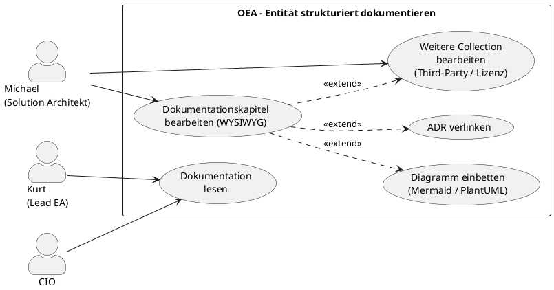

# UC-09: Entität strukturiert dokumentieren

## Diagramm



## Kurzbeschreibung

Der Solution Architekt dokumentiert eine Entität (z.B. ein System, eine Applikation, einen Drittanbieter) direkt in OEA über eine betreiberdefinierte Kapitelsammlung — verknüpft mit dem EA-Modell, ohne separates Dokumentations-Tool. Typische Anwendungsfälle sind Arc42-Architekturdokumentation, Third-Party-Management oder ein Lizenzregister.

## Primärer Akteur

**SH-04 – Michael, Solution Architekt im Mittelstand**

Sekundäre Akteure: SH-03 (Lead EA liest Dokumentation mit), SH-05 (CIO im Web Portal)

## Ziel

Jede Entität kann mit einer oder mehreren betreiberdefinierten Dokumentationssammlungen verknüpft werden. Die Inhalte leben im EA-Repository, sind über Viewpoints sichtbar und mit ADRs, NFRs und dem Diagramm-Canvas verbunden.

## Vorbedingungen

- Mindestens eine `DocumentCollectionDefinition` ist im MetamodelConfiguration konfiguriert und dem EntityType der zu dokumentierenden Entität zugewiesen (UC-04)
- Die zu dokumentierende Entität existiert als ArchitectureEntity im Repository

## Hauptfluss

*Standardfall: Michael dokumentiert ein System nach Arc42*

1. Michael öffnet die ArchitectureEntity „CRM-System" (application-component, id=1)
2. Das System zeigt den Tab „Dokumentation" mit allen zugewiesenen `DocumentCollectionDefinitions` als Reiter
3. Michael wählt den Reiter „Arc42 Architektur" und sieht alle 12 Kapitel als Abschnitte
4. Michael klickt auf „1. Kontextabgrenzung" — ein WYSIWYG-Editor öffnet sich
5. Michael schreibt den Kontext-Text und fügt einen Mermaid-Block (C4-Context-Diagramm) ein
6. Das System rendert den Mermaid-Block als Vorschau inline im Editor
7. Michael speichert — das System legt eine `documentation-entry`-Entität an und verknüpft sie via `documents` mit id=1
8. Michael wechselt zu „9. Architekturentscheidungen" und verlinkt bestehende ADRs per Link im Editor
9. Michael wechselt zu „5. Bausteinsicht" und fügt ein PlantUML-Komponentendiagramm ein
10. Nach Abschluss: alle befüllten Kapitel sind in der Übersicht mit Status „✓" markiert

## Alternativflüsse

**A1 – Andere DocumentCollection (z.B. Third-Party Management):**
- Schritt 2a: Michael wechselt zum Reiter „Third-Party Management" derselben Entität
- Michael befüllt dort Kapitel „Vendor-Bewertung", „SLA-Bedingungen" und „Exit-Strategie"
- Für jedes Kapitel wird eine eigene `documentation-entry`-Entität angelegt und via `documents` verknüpft

**A2 – PlantUML-Server nicht verfügbar:**
- Schritt 6a: Das Rendering schlägt fehl; System zeigt Code-Fallback (roher Text) und Warning-Icon
- Michael kann den Content speichern; Rendering wird beim nächsten Laden erneut versucht

**A3 – Mehrere Collections gleichzeitig sichtbar:**
- Schritt 2a: Für den EntityType sind „Arc42 Architektur", „Third-Party Management" und „Lizenzregister" konfiguriert
- Michael sieht alle drei als Reiter; befüllt je nach Bedarf einen oder mehrere

## Ausnahmen

**E1 – Entität ohne Collection-Zuweisung:**
- Kein Dokumentations-Tab erscheint; kein Fehler; Hinweis „Keine Dokumentationssammlung für diesen Typ konfiguriert"

**E2 – Kapitel-Inhalt wird überschrieben:**
- Pro (Subject-Entität + `chapterRef` + `collectionRef`) ist maximal ein Eintrag erlaubt (BR-05); erneutes Speichern überschreibt den bestehenden

## Akzeptanzkriterien

**AC1** (Tab erscheint für zugewiesenen Typ):
- Gegeben: EntityType `application-component` hat Collection `arc42-standard` zugewiesen
- Wenn: Michael öffnet CRM-System-Entität
- Dann: Tab „Dokumentation" mit Reiter „Arc42 Architektur" sichtbar; alle 12 Kapitel aufgelistet; unbefüllte Kapitel als leer

**AC2** (WYSIWYG Speichern):
- Wenn: Michael schreibt Text + Mermaid-Block und klickt Speichern
- Dann: `documentation-entry`-Entität angelegt mit `content`, verknüpft via `documents(sourceId=neu, targetId=1)`

**AC3** (Mermaid-Rendering):
- Wenn: Content enthält ```mermaid-Block
- Dann: Block wird als SVG-Diagramm gerendert; Fallback auf Code wenn mermaid.js nicht verfügbar

**AC4** (PlantUML-Rendering):
- Wenn: Content enthält ```plantuml-Block
- Dann: Block wird via konfigurierten PlantUML-Server oder WASM als SVG gerendert

**AC5** (Web Portal read-only):
- Wenn: CIO öffnet dieselbe Entität im Web Portal
- Dann: Dokumentations-Tab sichtbar; Inhalte lesbar; Mermaid/PlantUML gerendert; kein Bearbeitungs-Button

**AC6** (Fortschrittsanzeige):
- Wenn: 4 von 12 Kapiteln befüllt
- Dann: Übersicht zeigt „4 / 12 befüllt" und welche Kapitel noch leer sind

**AC7** (Mehrere Collections gleichzeitig):
- Wenn: Zwei Collections für denselben EntityType konfiguriert
- Dann: Beide Reiter sichtbar; Inhalte unabhängig voneinander befüllbar

## Nicht im Scope

- Automatisches Befüllen aus dem EA-Modell (v2.0 denkbar: Kontextabgrenzung aus Diagramm generieren)
- PDF-Export der Dokumentation (v2.0)
- Kollaborative Echtzeit-Bearbeitung (v2.0)

## Beziehung zu anderen Use Cases

- **UC-04**: Metamodell-Admin konfiguriert `DocumentCollectionDefinitions` und weist sie EntityTypes zu (Voraussetzung)
- **UC-05**: Architektur-Vision und Solutions definieren das modellierte System; UC-09 dokumentiert dessen Inhalte
- **UC-06**: Katalog kann `documentation-entry`-Entitäten auflisten (Überblick aller dokumentierten Entitäten)

## Konzept-Bezug

- §14 Erweiterbarkeit: `DocumentCollectionDefinition` als betreiberdefiniertes Metamodell-Konzept
- §18 Reporting: strukturierte Dokumentation als Ausgabe pro Entität
