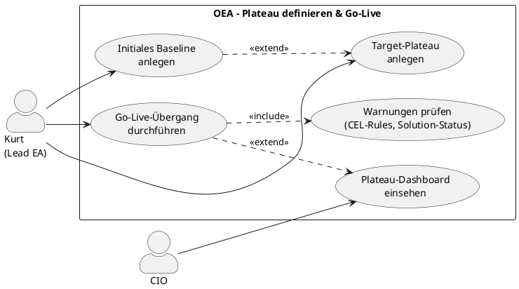

# UC-11: Architektur-Plateau definieren und produktiv setzen

## Diagramm

## Goal in Context

Organisationen, die im **Plateau-Modus** arbeiten, steuern die Weiterentwicklung ihrer Unternehmensarchitektur über klar definierte Zustände: ein Baseline-Plateau beschreibt die aktuelle Realität, Target-Plateaus beschreiben geplante Zielzustände. Der Lead Enterprise Architekt muss diese Zustände anlegen, pflegen und — wenn ein Zielzustand tatsächlich umgesetzt wurde — als neue produktive Realität festschreiben (Go-Live).

OEA unterstützt diesen Prozess, indem Kurt das initiale Baseline anlegen, beliebige Target-Plateaus planen und schliesslich einen Go-Live-Übergang durchführen kann. Der Übergang ist bewusst ein manueller, bestätigungspflichtiger Akt: OEA prüft keine Voraussetzungen erzwungen, zeigt aber alle konfigurierten Warnungen (CEL-Rules, Solution-Status), damit Kurt eine informierte Entscheidung treffen kann.

## Persona und Story

**Primärer Akteur**: [Kurt – Lead Enterprise Architekt](../../business-analysis/stakeholders/SH-03-kurt-lead-enterprise-architekt.md)

**Weitere Beteiligte**: [CIO](../../business-analysis/stakeholders/SH-05-cio-konzern.md) (beobachtet Fortschritt; kein aktiver Schritt im Ablauf)

**Story**: Als Lead Enterprise Architekt möchte ich die geplante Zielarchitektur meiner Organisation als Plateau erfassen und — sobald die Umsetzung abgeschlossen ist — als neue produktive Baseline festschreiben, damit der aktuelle Architekturstand jederzeit klar und nachvollziehbar dokumentiert ist.

## Trigger

1. OEA-Instanz ist im Plateau-Modus konfiguriert und es existiert noch kein Baseline-Plateau → Kurt legt das initiale Baseline an (A1)
2. Kurt möchte einen neuen Zielzustand für die Architektur planen → Target-Plateau anlegen (A2)
3. Ein Target-Plateau ist umgesetzt und soll zur neuen Produktiv-Architektur werden → Go-Live (Hauptablauf)

## Vorbedingungen (Pre-Conditions)

- [ ] Plateau-Modus ist für die OEA-Instanz aktiviert (Instanz-Konfiguration)
- [ ] Kurt ist eingeloggt (UC-01) und hat die Rolle „EA-Manager" oder eine Rolle mit entsprechender Berechtigung
- [ ] Für den Hauptablauf (Go-Live): ein Baseline-Plateau (`status=baseline`) und mindestens ein Target-Plateau (`status=target`) existieren

## Nachbedingungen (Post-Conditions)

### Bei Erfolg (Hauptablauf — Go-Live)

- Das gewählte Target-Plateau P1 hat `status=baseline`; `validFrom` ist auf den Go-Live-Zeitpunkt gesetzt
- Das bisherige Baseline-Plateau P0 hat `status=realized`; `validTo` ist auf den Go-Live-Zeitpunkt gesetzt; P0 ist read-only (BR-03)
- Entitäten, die in P1 den Lifecycle-State `retiring` hatten, sind nach dem Übergang `retired`
- Der CIO kann den Go-Live-Eintrag im Plateau-Dashboard einsehen
- Andere Target-Plateaus bleiben unverändert (keine system-seitigen Rebase-Automatismen; Umgang mit ihnen liegt beim Betreiber und konfigurierten Business Rules)

### Bei Misserfolg

- Kein Plateau-Objekt wurde verändert; vollständiger Rollback der atomaren Transition
- Fehlermeldung mit konkretem Hinweis (Berechtigung, DB-Fehler, Bestätigung abgebrochen)

## Hauptablauf (Basic Flow)

*Standardfall: Kurt führt einen Go-Live-Übergang für ein bestehendes Target-Plateau durch*

1. **Kurt**: navigiert zur Plateau-Übersicht (`/plateaus`)
2. **System**: zeigt alle Plateaus strukturiert:
   - Aktuelles Baseline (status=`baseline`, hervorgehoben)
   - Target-Plateaus (status=`target`, mit geplantem validFrom)
   - Realisierte Plateaus (status=`realized`, chronologisch, einklappbar)
3. **Kurt**: wählt ein Target-Plateau P1 aus
4. **System**: zeigt die Plateau-Detailansicht mit:
   - Name, Beschreibung, geplantes Go-Live-Datum (`validFrom`)
   - Verknüpfte Solutions: Liste mit Name, Status (`draft`, `proposed`, `implemented`, …) und Owner
   - Entitäten-Zusammenfassung: N Entitäten `active`, M `retiring`, K neu gegenüber Baseline
   - CEL-Rule-Violations (sofern Business Rules konfiguriert): Severity `hint`/`warning` (kein Enforcement; Violations blockieren Go-Live nicht)
5. **Kurt**: prüft die Zusammenfassung und entscheidet, Go-Live durchzuführen
6. **Kurt**: klickt „Go-Live durchführen"
7. **System**: zeigt einen Bestätigungsdialog mit:
   - Übersicht: „P1 wird zur neuen Baseline; P0 wird archiviert (realized, read-only)"
   - Anzahl nicht-implemented Solutions (Warnung, kein Block)
   - Anzahl offener CEL-Violations (Warnung, kein Block)
   - Expliziter Hinweis: „Diese Aktion kann nicht rückgängig gemacht werden"
8. **Kurt**: bestätigt durch Eingabe des Plateau-Namens (zweistufige Bestätigung)
9. **System**: führt die atomare Transition durch:
   - P1: `status` → `baseline`; `validFrom` = jetzt (UTC)
   - P0: `status` → `realized`; `validTo` = jetzt (UTC); ab sofort read-only (BR-03)
   - Entitäten mit `lifecycle_state=retiring` in P1 → `lifecycle_state=retired`
10. **System**: zeigt Erfolgsmeldung; leitet zur aktualisierten Plateau-Übersicht weiter
11. **System**: Plateau-Dashboard zeigt Go-Live-Eintrag mit Zeitstempel — für SH-05 CIO einsehbar

## Alternative Abläufe (Alternative Flows)

**A1 – Initiales Baseline-Plateau anlegen**

*Wenn im Plateau-Modus noch kein Baseline existiert (Erst-Einrichtung)*

1. **System**: zeigt auf der Plateau-Übersicht einen Hinweis: „Noch kein Baseline-Plateau vorhanden. Lege das initiale Baseline an, um mit der strategischen EA-Planung zu beginnen."
2. **Kurt**: klickt „Initiales Baseline anlegen"
3. **System**: öffnet Erstellungsformular:
   - Name (z.B. „Baseline 2026-Q2", Pflichtfeld)
   - Beschreibung (optional, max. 2000 Zeichen)
   - `validFrom` (Datum; Bedeutung: „Stand zu diesem Stichtag"; optional)
4. **Kurt**: füllt Formular aus und speichert
5. **System**: legt Plateau mit `status=baseline` an; `createdAt`/`createdBy` gesetzt
6. **System**: zeigt Hinweis: „Initiales Baseline angelegt. Erfasse jetzt die bestehende Architektur direkt im Baseline oder lege ein Target-Plateau für die Zielarchitektur an (A2)."
7. Weiter: Kurt erfasst Entitäten im Baseline oder fährt mit A2 fort

**A2 – Target-Plateau anlegen**

*Wenn eine neue Zielarchitektur geplant werden soll*

1. **Kurt**: klickt in der Plateau-Übersicht „Neues Ziel-Plateau anlegen"
2. **System**: öffnet Erstellungsformular:
   - Name (z.B. „Target Cloud-Migration 2027", Pflichtfeld)
   - Beschreibung / strategische Begründung (optional)
   - `validFrom` (geplantes Go-Live-Datum; optional)
   - `succeeds` (Dropdown: aktuelles Baseline vorausgewählt; änderbar auf beliebiges anderes Plateau)
3. **Kurt**: füllt Formular aus und speichert
4. **System**: legt Plateau mit `status=target` an; `succeeds`-Referenz gesetzt
5. **System**: zeigt die Plateau-Detailansicht; Solution Architekten können nun Solutions diesem Target-Plateau zuordnen (UC-05 A1)

**A3 – Transition-Plateau als Zwischenzustand**

*Wenn zwischen Baseline und Target ein gestaffelter Zwischenzustand sinnvoll ist*

1. Identischer Ablauf wie A2, aber Kurt wählt `status=transition` statt `target`
2. Transition-Plateaus folgen denselben Regeln wie Target-Plateaus; sie können ebenfalls Go-Live gehen (Hauptablauf)
3. Verwendung: optionale Modellierung von Migrationsphasen (z.B. „Phase 1 — Salesforce-Einführung" vor dem finalen Target)

## Ausnahmen / Fehlerfälle (Exception Flows)

**E1 – Kein Baseline vorhanden beim Go-Live-Versuch**
- Bedingung: Kurt versucht Go-Live, aber kein `status=baseline`-Plateau existiert
- Erwartete Reaktion: System zeigt Fehlermeldung „Kein Baseline-Plateau vorhanden. Lege zuerst ein initiales Baseline an."; Link zu A1
- Wiederaufnahme: Kurt führt A1 durch

**E2 – Go-Live-Bestätigung abgebrochen**
- Bedingung: Kurt bricht den Bestätigungsdialog (Schritt 7–8) ab oder gibt falschen Plateau-Namen ein
- Erwartete Reaktion: Dialog schliesst sich; keine Änderung an Daten; Plateau verbleibt in `status=target`
- Wiederaufnahme: Kurt kann jederzeit einen neuen Go-Live-Versuch starten

**E3 – Atomare Transition schlägt fehl (technischer Fehler)**
- Bedingung: DB-Fehler, Constraint-Verletzung oder Timeout während der Transition in Schritt 9
- Erwartete Reaktion: vollständiger Rollback; beide Plateaus (P0, P1) bleiben im ursprünglichen Status; Fehlermeldung mit technischem Hinweis
- Wiederaufnahme: Kurt kann Go-Live erneut versuchen; kein Datenverlust

**E4 – Fehlende Berechtigung**
- Bedingung: Die eingeloggte Person hat nicht die Rolle „EA-Manager" oder vergleichbare Berechtigung
- Erwartete Reaktion: 403 Forbidden; Schaltflächen „Go-Live" und „Anlegen" sind nicht sichtbar oder deaktiviert
- Wiederaufnahme: Person wendet sich an Admin (UC-02)

## Datenfluss

| Schritt | Daten | Richtung | Bemerkung |
|---|---|---|---|
| 2 | Plateau-Liste (id, name, status, validFrom) | System → Kurt | Alle Plateaus der Instanz |
| 4 | Plateau-Detail (Solutions, Entity-Summary, CEL-Violations) | System → Kurt | Nur Warnungen; kein Block |
| 7 | Bestätigungsdialog (Zusammenfassung, Risiko-Hinweis) | System → Kurt | Zeigt Anzahl nicht-implemented Solutions und Violations |
| 8 | Plateau-Name (Bestätigung) | Kurt → System | Zweistufige Bestätigung; verhindert versehentliche Go-Lives |
| 9 | Plateau-Status-Update (P1, P0), Entity-State-Update | System intern | Atomare Transaktion; vollständiger Rollback bei Fehler |
| 11 | Go-Live-Eintrag (Zeitstempel, Plateau-Namen) | System → Dashboard | Für CIO einsehbar |

## Beteiligte Business Objects

| Business Object | Operation | Notiz |
|---|---|---|
| [plateau](../../business-objects/plateau.md) | create, update | Kern-Objekt; status-Übergang ist die zentrale Operation |
| [entity](../../business-objects/entity.md) | update | `lifecycle_state` pro Plateau wird bei Go-Live aktualisiert |
| [solution](../../business-objects/solution.md) | read | Status-Übersicht im Bestätigungsdialog; kein Update durch diesen UC |
| [architecture](../../business-objects/architecture.md) | read | Betriebsmodus-Prüfung (Plateau-Modus erforderlich) |
| [person](../../business-objects/person.md) | read | Authentifizierung; `createdBy` bei Anlage |
| [role](../../business-objects/role.md) | read | Berechtigungsprüfung: EA-Manager-Rolle |

## Akzeptanzkriterien

- [ ] A1: Initiales Baseline-Plateau ohne Vorgänger anlegbar; `status=baseline` wird gesetzt
- [ ] A2: Target-Plateau anlegbar mit `succeeds`-Referenz auf bestehendes Baseline; `status=target`
- [ ] A3: Transition-Plateau anlegbar mit `status=transition`; kann ebenfalls Go-Live gehen
- [ ] Plateau-Übersicht zeigt Baseline, Targets und realisierte Plateaus klar getrennt
- [ ] Go-Live-Zusammenfassung zeigt: verknüpfte Solutions mit Status, CEL-Violations (falls konfiguriert), Entity-Zahlen
- [ ] Go-Live ist **nicht** blockiert wenn Solutions nicht-implemented sind — nur Warnung
- [ ] Go-Live ist **nicht** blockiert durch CEL-Violations — nur Warnung
- [ ] Zweistufige Bestätigung (Eingabe Plateau-Name) vor Go-Live erzwungen
- [ ] Nach Go-Live: P1 hat `status=baseline`; P0 hat `status=realized` und ist read-only
- [ ] Andere Target-Plateaus bleiben nach Go-Live unverändert; kein system-seitiger Rebase
- [ ] Atomare Transition: bei technischem Fehler vollständiger Rollback; kein Inkonsistenz-Zustand
- [ ] CIO kann Go-Live-Eintrag mit Zeitstempel im Dashboard einsehen
- [ ] E4: Ohne EA-Manager-Rolle sind Go-Live und Anlegen-Aktionen nicht zugänglich (403)

## Nicht im Scope

- **Solution-Status-Übergänge** (`draft → proposed → implemented`): Teil von UC-05 und Solution-Review-Prozess
- **Entitäten direkt im Baseline erfassen**: Basis-Entitätsverwaltung (eigener UC, noch nicht angelegt)
- **Plateau löschen**: kein geplantes Feature; Plateaus sind unveränderliche Architektur-Historie
- **Automatischer Rebase anderer Target-Plateaus**: bewusst nicht im System — Betreiber definiert via Business Rules (ADR-017, ADR-018)
- **Projekt-Modus**: dieser UC gilt ausschliesslich für Instanzen im Plateau-Modus
