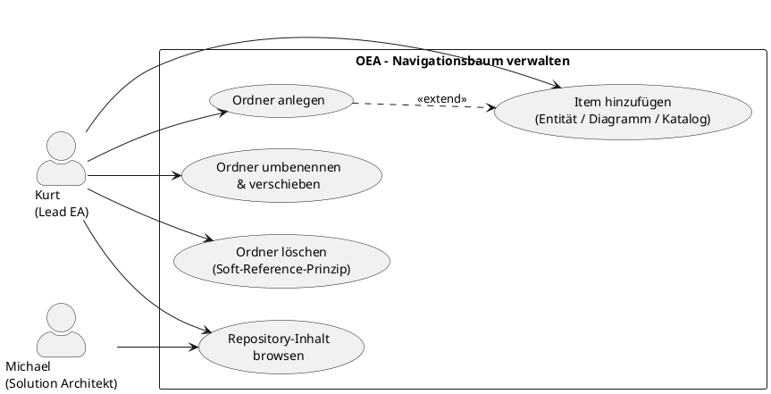

# UC-13: Navigationsbaum verwalten

## Diagramm

## Goal in Context

Ein wachsendes EA-Repository — mit Hunderten von Entitäten, Diagrammen und Katalogen — braucht eine fachlich sinnvolle Struktur, die unabhängig von der internen Datenhaltung ist. Der Lead Enterprise Architekt organisiert Repository-Inhalte im Navigationsbaum so, dass alle Nutzerinnen und Nutzer den Inhalt schnell finden und in einer vertrauten Logik durchsuchen können.

Wichtig: Der Navigationsbaum ist reine Navigation. Er speichert keine Inhalte; er verweist auf bestehende Entitäten, Diagramme und Kataloge. Das Löschen eines Ordners löscht nie die referenzierten Inhalte — nur den Navigationseintrag (Soft-Reference-Prinzip).

## Persona und Story

**Primärer Akteur**: [Kurt – Lead Enterprise Architekt](../../business-analysis/stakeholders/SH-03-kurt-lead-enterprise-architekt.md)

**Weitere Beteiligte**: [Michael – Solution Architekt](../../business-analysis/stakeholders/SH-04-michael-solution-architekt.md) (legt Inhalte an, die Kurt in den Baum einhängt; kein aktiver Schritt in diesem UC)

**Story**: Als Lead Enterprise Architekt möchte ich das Architecture-Repository in einer Ordnerstruktur organisieren, damit alle Beteiligten Entitäten, Diagramme und Kataloge schnell finden — ohne die semantische Verknüpfung der Daten zu verändern.

## Trigger

1. Eine neue Fachdomäne oder Initiative soll im Repository strukturiert werden → neuer Ordner anlegen
2. Ein Inhalt (Entität, Diagramm, Katalog) wurde neu angelegt und soll im Baum sichtbar sein → Item hinzufügen
3. Die bestehende Ordnerstruktur passt nicht mehr zur Organisation → Ordner umbenennen, verschieben oder reorganisieren
4. Ein veralteter Ordner soll entfernt werden → Ordner löschen

## Vorbedingungen (Pre-Conditions)

- [ ] Kurt ist eingeloggt (UC-01) und hat die Rolle „EA-Manager" oder eine Rolle mit Repository-Organisations-Berechtigung
- [ ] Die OEA-Instanz ist eingerichtet; der Wurzelknoten existiert (wird automatisch beim Instanz-Setup angelegt)
- [ ] Für das Hinzufügen von Items: die Entität, das Diagramm oder der Katalog existiert bereits im Repository

## Nachbedingungen (Post-Conditions)

### Bei Erfolg

- Der Navigationsbaum reflektiert die gewünschte Struktur
- Referenzierte Objekte (Entitäten, Diagramme, Kataloge) sind inhaltlich unverändert
- `sortOrder`-Werte sind konsistent (keine Lücken nötig; das System erlaubt beliebige Reihenfolgen)

### Bei Misserfolg

- Keine Änderung am Baum; betroffene Knoten und Items unverändert
- Fehlermeldung mit konkretem Hinweis

## Hauptablauf (Basic Flow)

*Standardfall: Kurt legt einen neuen Ordner an und hängt Inhalte ein*

1. **Kurt**: öffnet den Navigationsbaum im Client App oder Web Portal
2. **System**: zeigt den Baum ab Wurzelknoten; Ordner aufklappbar/zuklappbar; Items mit Typ-Icon (Entität, Diagramm, Katalog)
3. **Kurt**: wählt einen bestehenden Knoten als Elternknoten und klickt „Neuer Ordner"
4. **System**: legt einen neuen TreeNode direkt im Baum als editierbaren Inline-Eintrag an
5. **Kurt**: gibt Namen ein und bestätigt (Enter oder Fokus-Verlust)
6. **System**: validiert (BR-01: Name eindeutig unter Geschwistern); persistiert; zeigt neuen Ordner im Baum
7. **Kurt**: wählt den neuen Ordner aus und klickt „Inhalt hinzufügen"
8. **System**: öffnet einen Such-Dialog über alle Repository-Inhalte:
   - Suche nach Name / Entitätstyp / Katalogtitel
   - Filter nach Inhaltstyp: Entität, Diagramm, Katalog
   - Mehrfachauswahl möglich
9. **Kurt**: wählt einen oder mehrere Inhalte aus und bestätigt
10. **System**: legt `TreeNodeItem`-Einträge an; zeigt Items im Ordner
11. **Kurt**: passt die Reihenfolge per Drag & Drop an (sortOrder)
12. **System**: persistiert die neue `sortOrder`-Reihenfolge

## Alternative Abläufe (Alternative Flows)

**A1 – Ordner umbenennen**

1. **Kurt**: doppelklickt auf einen Ordnernamen (oder Kontextmenü → „Umbenennen")
2. **System**: macht den Namen inline editierbar
3. **Kurt**: ändert den Namen und bestätigt
4. **System**: validiert (BR-01); persistiert; zeigt neuen Namen

**A2 – Ordner oder Item verschieben**

1. **Kurt**: zieht einen Ordner oder ein Item per Drag & Drop auf einen anderen Elternknoten
2. **System**: prüft:
   - BR-03: kein Zyklus (Ordner darf nicht in einen eigenen Nachkommen verschoben werden)
   - BR-01: Name des verschobenen Ordners muss im Zielknoten eindeutig sein
3. **System**: aktualisiert `parentId` und `sortOrder`; zeigt den Baum aktualisiert

**A3 – Item aus einem Ordner entfernen**

1. **Kurt**: wählt ein Item im Ordner → Kontextmenü → „Aus diesem Ordner entfernen"
2. **System**: zeigt Hinweis: „Nur der Navigationseintrag wird entfernt. Die Entität / das Diagramm / der Katalog bleibt erhalten."
3. **Kurt**: bestätigt
4. **System**: entfernt das `TreeNodeItem`; das referenzierte Objekt ist unverändert; verbleibende Verweise auf dasselbe Objekt in anderen Ordnern bleiben gültig (BR-06)

**A4 – Ordner löschen**

1. **Kurt**: wählt einen Ordner → Kontextmenü → „Ordner löschen"
2. **System**: prüft BR-02 (Wurzelknoten nicht löschbar); zeigt Warnung:
   - „Dieser Ordner und alle N Unterordner und M Einträge werden gelöscht."
   - „Die referenzierten Entitäten, Diagramme und Kataloge bleiben erhalten." (BR-05)
3. **Kurt**: bestätigt
4. **System**: löscht den Ordner rekursiv (alle Kinder und Items); referenzierte Objekte unberührt (BR-05)

**A5 – Dasselbe Objekt in mehrere Ordner einhängen**

1. **Kurt**: navigiert zu einem zweiten Ordner und klickt „Inhalt hinzufügen" (Schritt 7)
2. **Kurt**: sucht und wählt dasselbe Objekt (z.B. denselben Katalog), das bereits in einem anderen Ordner liegt
3. **System**: legt einen zweiten `TreeNodeItem`-Eintrag an (anderer Ordner, selbe `referenceId`) — BR-06 explizit erlaubt
4. **System**: zeigt das Objekt jetzt in beiden Ordnern; kein Duplikat der Daten

**A6 – Wurzelknoten umbenennen**

1. **Kurt**: doppelklickt auf den Wurzelknoten
2. **System**: macht den Namen editierbar (BR-02: nur Umbenennen erlaubt, kein Löschen)
3. **Kurt**: gibt neuen Namen ein (z.B. Unternehmensname) und bestätigt
4. **System**: persistiert; zeigt neuen Wurzelnamen

## Ausnahmen / Fehlerfälle (Exception Flows)

**E1 – Name nicht eindeutig unter Geschwistern (BR-01)**
- Bedingung: Ein Ordner oder umbenannter Ordner hat denselben Namen wie ein Geschwisterknoten
- Erwartete Reaktion: Inline-Validierungsfehler; Speichern blockiert bis der Name geändert wird
- Wiederaufnahme: Kurt wählt einen anderen Namen

**E2 – Zyklus beim Verschieben (BR-03)**
- Bedingung: Kurt versucht, einen Ordner in einen seiner eigenen Nachkommen zu ziehen
- Erwartete Reaktion: Drag & Drop visuell blockiert (kein gültiges Drop-Target); bei API-Versuch 422 mit Fehlermeldung
- Wiederaufnahme: Kurt wählt ein gültiges Ziel

**E3 – Wurzelknoten löschen versucht (BR-02)**
- Bedingung: Kurt versucht, den Wurzelknoten zu löschen
- Erwartete Reaktion: Löschen-Option im Kontextmenü des Wurzelknotens nicht vorhanden
- Wiederaufnahme: nicht nötig; UI verhindert die Aktion

**E4 – Referenziertes Objekt existiert nicht mehr (BR-04)**
- Bedingung: Ein `TreeNodeItem` verweist auf ein Objekt, das zwischenzeitlich gelöscht wurde (z.B. Katalog gelöscht)
- Erwartete Reaktion: Item wird im Baum mit „[Inhalt nicht mehr vorhanden]" und Warnsymbol angezeigt; Kurt kann es über „Entfernen" bereinigen
- Wiederaufnahme: Kurt entfernt das verwaiste Item (A3) oder stellt das Objekt wieder her

**E5 – Fehlende Berechtigung**
- Bedingung: Eingeloggte Person hat keine Repository-Organisations-Berechtigung
- Erwartete Reaktion: Baum ist lesbar (read-only); Bearbeitungsoptionen (Neuer Ordner, Verschieben, Löschen) nicht sichtbar
- Wiederaufnahme: Person wendet sich an Admin (UC-02)

## Datenfluss

| Schritt | Daten | Richtung | Bemerkung |
|---|---|---|---|
| 2 | Baumstruktur (TreeNodes + Items mit Typ und Name) | System → Kurt | Vollständig ab Wurzelknoten; lazy-loaded bei tiefen Bäumen |
| 5 | Name des neuen Ordners | Kurt → System | Inline-Eingabe |
| 8–9 | Suche + Auswahl (referenceId, itemType, displayLabel) | Kurt → System | Mehrfachauswahl möglich |
| 11 | sortOrder-Änderungen (ItemId, neuer sortOrder) | Kurt → System | Drag & Drop |
| A2 | parentId, sortOrder (verschobener Knoten) | Kurt → System | Drag & Drop; BR-01/BR-03 geprüft |

## Beteiligte Business Objects

| Business Object | Operation | Notiz |
|---|---|---|
| [tree-node](../../business-objects/tree-node.md) | create, update, delete | Kern-Objekt; Wurzelknoten nicht löschbar (BR-02) |
| [catalog](../../business-objects/catalog.md) | read | Als Item-Ziel referenzierbar; inhaltlich unverändert |
| [entity](../../business-objects/entity.md) | read | Als Item-Ziel referenzierbar; inhaltlich unverändert |
| [person](../../business-objects/person.md) | read | `createdBy`; Berechtigungsprüfung |
| [role](../../business-objects/role.md) | read | Repository-Organisations-Berechtigung prüfen |

## Akzeptanzkriterien

- [ ] Neuen Ordner unter beliebigem Elternknoten anlegen; Inline-Bearbeitung des Namens
- [ ] E1: Doppelter Name unter Geschwistern wird mit Inline-Fehler abgelehnt (BR-01)
- [ ] Items hinzufügen via Such-Dialog (Entität, Diagramm, Katalog); Mehrfachauswahl
- [ ] A5: Dasselbe Objekt kann in mehreren Ordnern gleichzeitig referenziert sein (BR-06)
- [ ] A1: Ordner umbenennen via Doppelklick / Inline-Edit
- [ ] A2: Ordner und Items per Drag & Drop verschieben; BR-03 (Zyklus) visuell verhindert
- [ ] A3: Item aus Ordner entfernen mit Hinweis auf Soft-Reference; referenziertes Objekt bleibt erhalten
- [ ] A4: Ordner löschen mit Warnung (N Kinder, M Items betroffen); referenzierte Objekte bleiben erhalten (BR-05)
- [ ] E3: Wurzelknoten hat keine Löschen-Option (BR-02); Umbenennen via A6 möglich
- [ ] E4: Verwaiste Items (Ziel gelöscht) werden mit Warnsymbol angezeigt und können entfernt werden
- [ ] E5: Ohne Berechtigung ist der Baum read-only; Bearbeitungsoptionen nicht sichtbar
- [ ] US-054: Navigationsbaum strukturieren ist vollständig durch diesen UC abgedeckt

## Nicht im Scope

- **Inhalte anlegen**: Entitäten, Diagramme und Kataloge werden in ihren eigenen UCs angelegt (UC-05, UC-06, künftige Diagramm-UCs); UC-13 organisiert nur bestehende Inhalte
- **Berechtigungen pro Ordner**: Zugriffssteuerung über TreeNodes ist nicht geplant (v1.0); Berechtigungen werden rollen- und instanzweit vergeben
- **Mehrere Bäume pro Instanz**: In v1.0 gibt es genau einen Navigationsbaum pro Instanz; mehrere benannte Bäume sind deferred
- **Baum-Export/Import**: kein v1.0-Feature; der Baum ist instanzspezifische Navigation, kein portables Artefakt
