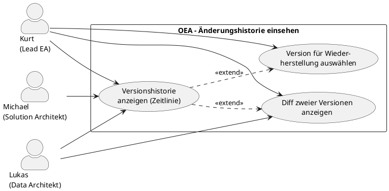

# UC-14: Änderungshistorie einer Entität einsehen

## Diagramm

## Goal in Context

Ein Architecture Repository ist nur dann vertrauenswürdig, wenn nachvollziehbar ist, wer was wann geändert hat. Der Lead Enterprise Architekt und berechtigte Nutzer müssen die vollständige Änderungshistorie einer Entität einsehen können — als Zeitlinie mit Diff-Ansicht, ohne separates Audit-Tool.

OEA speichert vor jedem Update einen unveränderlichen Snapshot des Vorzustands in `entity_versions` (ADR-016, BR-12/BR-13 in entity.md). UC-14 macht diese Snapshots für Nutzer zugänglich.

## Persona und Story

**Primärer Akteur**: [Kurt – Lead Enterprise Architekt](../../business-analysis/stakeholders/SH-03-kurt-lead-enterprise-architekt.md)

**Weitere Beteiligte**:
- [Lukas – Senior Data Architekt](../../business-analysis/stakeholders/SH-02-lukas-senior-data-architekt.md) (Audit- und Compliance-Zwecke)
- [Michael – Solution Architekt](../../business-analysis/stakeholders/SH-04-michael-solution-architekt.md) (prüft Änderungen in seinem Zuständigkeitsbereich)

**Story**: Als Lead Enterprise Architekt möchte ich nachvollziehen können, wer eine Entität wann geändert hat und was genau verändert wurde — damit ich Änderungen begründen, Fehler erkennen und bei Bedarf zur vorherigen Version zurückkehren kann (UC-15).

## Trigger

1. Eine Entität zeigt einen unerwarteten Zustand — Kurt will wissen, wann und durch wen die Änderung eingetreten ist
2. Compliance-Anforderung: Lukas muss belegen, dass eine Entität zu einem bestimmten Zeitpunkt einen definierten Zustand hatte
3. Vorbereitung einer Wiederherstellung (UC-15): Kurt prüft den Verlauf, bevor er einen alten Stand auswählt

## Vorbedingungen (Pre-Conditions)

- [ ] Kurt ist eingeloggt (UC-01) und hat Leseberechtigung auf die betreffende Entität
- [ ] Die Entität existiert im Repository und hat mindestens eine Änderungsversion (d.h. wurde seit Anlage mindestens einmal bearbeitet)

## Nachbedingungen (Post-Conditions)

### Bei Erfolg

- Kurt sieht die vollständige Versionshistorie der Entität als Zeitlinie
- Kein Datensatz wurde verändert; der UC ist rein lesend

### Bei Misserfolg

- Fehlermeldung mit Hinweis (fehlende Berechtigung, Entität nicht gefunden)

## Hauptablauf (Basic Flow)

*Standardfall: Kurt öffnet die Versionshistorie einer Entität und betrachtet eine Änderung im Detail*

1. **Kurt**: öffnet die Detailansicht einer Entität (z.B. „SAP ERP", id=42)
2. **System**: zeigt die Entitätsdetails; im Header ist ein „Historie"-Tab sichtbar (sofern `entity_versions`-Einträge vorhanden)
3. **Kurt**: klickt auf „Historie"
4. **System**: zeigt eine chronologische Zeitlinie aller Versionen, neueste zuerst:
   - Versionsnummer (v1, v2, v3 …)
   - Zeitstempel (UTC)
   - Geändert von (Name der Person, verlinkt auf Profil)
   - Änderungsgrund (falls beim Update angegeben; sonst leer)
   - Kurzübersicht geänderter Felder (z.B. „name, description" oder „properties.owner")
5. **Kurt**: klickt auf eine Version (z.B. v4)
6. **System**: zeigt einen Diff zwischen v4 und v5 (dem Nachfolger):
   - Geänderte Felder mit Vorher/Nachher-Werten (farblich hervorgehoben: rot = entfernt, grün = hinzugefügt)
   - Unveränderte Felder werden nicht angezeigt (Fokus auf Änderungen)
7. **Kurt**: kann optional „Vollständiger Stand v4" aufklappen, um den gesamten Entitätszustand zu diesem Zeitpunkt zu sehen

## Alternative Abläufe (Alternative Flows)

**A1 – Zeitraumfilter setzen**

1. **Kurt**: klickt in der Zeitlinie auf „Filtern"
2. **System**: zeigt Datumsfilter (Von / Bis) und Actor-Filter (Person auswählen)
3. **Kurt**: setzt Filter; System zeigt nur Versionen im gewählten Zeitraum / von der gewählten Person

**A2 – Zwei Versionen direkt vergleichen**

1. **Kurt**: wählt in der Zeitlinie zwei Versionen per Checkbox aus (z.B. v2 und v7)
2. **System**: zeigt Diff zwischen v2 und v7 — alle Änderungen über den gesamten Zeitraum kumuliert

**A3 – Von Historie direkt zur Wiederherstellung wechseln**

1. **Kurt**: sieht in der Detailansicht einer Version die Schaltfläche „Diese Version wiederherstellen"
2. **Kurt**: klickt die Schaltfläche → System leitet zu UC-15 mit vorausgefüllter Versionsnummer weiter

**A4 – Entität ohne Änderungshistorie**

1. **Kurt**: öffnet eine Entität, die seit Anlage nie bearbeitet wurde
2. **System**: zeigt im Historie-Tab: „Keine Änderungen seit Anlage. Erstellt am [Datum] von [Person]."

## Ausnahmen / Fehlerfälle (Exception Flows)

**E1 – Fehlende Leseberechtigung**
- Bedingung: Kurt hat keine Leseberechtigung auf die Entität (z.B. Solution-scoped Entität ausserhalb seines Bereichs)
- Erwartete Reaktion: 403; Historie-Tab nicht sichtbar
- Wiederaufnahme: Person wendet sich an Admin (UC-02)

**E2 – Entität nicht gefunden**
- Bedingung: Direkt-Link auf Entität mit gelöschter ID
- Erwartete Reaktion: 404 mit klarer Meldung
- Wiederaufnahme: Kurt navigiert zurück zum Katalog

## Datenfluss

| Schritt | Daten | Richtung | Bemerkung |
|---|---|---|---|
| 4 | Versionsliste (version, changedAt, changedBy, changedFields[], changeReason) | System → Kurt | Absteigend sortiert; paginiert bei > 50 Einträgen |
| 6 | Diff (fieldName, oldValue, newValue) je geändertem Feld | System → Kurt | Nur geänderte Felder; Properties-Objekt wird feldweise aufgebrochen |
| 7 | Vollständiger Entitätszustand zur gewählten Version | System → Kurt | Snapshot aus `entity_versions` |

## Beteiligte Business Objects

| Business Object | Operation | Notiz |
|---|---|---|
| [entity](../../business-objects/entity.md) | read | Aktuelle Version + Versionssnapshots aus `entity_versions` |
| [person](../../business-objects/person.md) | read | `changedBy` in jeder Versionszeile |
| [role](../../business-objects/role.md) | read | Leseberechtigung auf die Entität prüfen |

## Akzeptanzkriterien

- [ ] Historie-Tab erscheint auf jeder Entität mit mindestens einer gespeicherten Version
- [ ] Zeitlinie zeigt alle Versionen mit Nummer, Zeitstempel, Actor und geänderten Feldern
- [ ] Diff-Ansicht zeigt Vorher/Nachher pro Feld; Properties werden feldweise aufgebrochen, nicht als JSON-Blob
- [ ] A1: Zeitraum- und Actor-Filter reduzieren die angezeigte Versionsliste korrekt
- [ ] A2: Zwei beliebige Versionen können direkt miteinander verglichen werden
- [ ] A3: Von der Versionsdetailansicht kann UC-15 (Wiederherstellen) direkt gestartet werden
- [ ] A4: Entitäten ohne Änderungshistorie zeigen einen aussagekräftigen Hinweis
- [ ] E1: Ohne Leseberechtigung ist der Historie-Tab nicht sichtbar (403)
- [ ] Rein lesender UC: keine Datenveränderung möglich

## Nicht im Scope

- **MetamodelConfiguration-Historie**: Änderungen am Metamodell (EntityTypes, Layers, Rules) werden in einem eigenen Audit-Log festgehalten; UC-14 deckt nur `ArchitectureEntity`-Versionen ab
- **Massenhistorie** (alle Änderungen aller Entitäten): globales Audit-Log ist ein eigener UC (noch nicht angelegt; Compliance-Anforderung)
- **Export der Historie** als PDF/CSV: deferred v2.0
