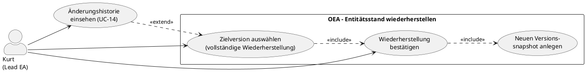

# UC-15: Entitätsstand wiederherstellen

## Diagramm

## Goal in Context

Fehlerhafte Änderungen passieren: ein Feld wurde falsch befüllt, eine Property irrtümlich gelöscht, ein falscher Name gesetzt. Der Lead Enterprise Architekt muss eine Entität auf einen früheren, bekannt-guten Zustand zurücksetzen können — ohne Datenverlust und ohne die Auditierbarkeit zu brechen.

Wichtig: Eine Wiederherstellung erzeugt einen **neuen** Versionseintragleintrag. Der Zustand vor der Wiederherstellung bleibt in der Historie erhalten. Es gibt kein stilles Überschreiben — jede Wiederherstellung ist selbst eine nachvollziehbare Änderung.

## Persona und Story

**Primärer Akteur**: [Kurt – Lead Enterprise Architekt](../../business-analysis/stakeholders/SH-03-kurt-lead-enterprise-architekt.md)

**Story**: Als Lead Enterprise Architekt möchte ich eine Entität auf einen früheren Stand zurücksetzen können, wenn eine Änderung fehlerhaft war — und dabei sicherstellen, dass die Wiederherstellung selbst in der Historie sichtbar bleibt.

## Trigger

1. Eine Entität wurde irrtümlich falsch bearbeitet (falscher Name, gelöschte Property, falscher Wert)
2. Kurt hat in UC-14 die Versionshistorie gesichtet und den gewünschten Zielstand identifiziert

## Vorbedingungen (Pre-Conditions)

- [ ] Kurt ist eingeloggt (UC-01) und hat Schreibberechtigung auf die Entität
- [ ] Die Entität hat mindestens eine frühere Version in `entity_versions`
- [ ] Kurt hat in UC-14 die gewünschte Zielversion identifiziert (typischer Einstiegspunkt)

## Nachbedingungen (Post-Conditions)

### Bei Erfolg

- Die Entität hat den Zustand der gewählten Version
- Der aktuelle Zustand vor der Wiederherstellung ist als neuer `entity_versions`-Snapshot gespeichert (unveränderlich)
- Die Wiederherstellung selbst ist als Versionsänderung sichtbar: `changedBy`, `changedAt`, optionaler `changeReason`, Markierung als `restoredFromVersion: N`
- Die `version`-Zahl der Entität wurde um 1 erhöht

### Bei Misserfolg

- Die Entität ist unverändert; kein neuer Snapshot
- Fehlermeldung mit konkretem Hinweis

## Hauptablauf (Basic Flow)

*Standardfall: Kurt stellt eine Entität auf eine frühere Version zurück*

1. **Kurt**: befindet sich in der Versionshistorie einer Entität (UC-14) und hat Version v4 als Zielstand identifiziert
2. **Kurt**: klickt in der Detailansicht von v4 auf „Diese Version wiederherstellen"
3. **System**: zeigt einen Bestätigungsdialog mit:
   - Diff: was wird sich gegenüber dem aktuellen Stand ändern (welche Felder, Vorher/Nachher)
   - Hinweis: „Der aktuelle Stand wird in der Historie gespeichert und kann jederzeit wieder aufgerufen werden"
   - Hinweis: „Unveränderliche Felder (ID, Typ, Verbindungsendpunkte) werden nicht verändert"
   - Optionales Freitextfeld: „Grund der Wiederherstellung" (z.B. „Irrtümliche Änderung durch Mitarbeiter XY rückgängig")
4. **Kurt**: füllt optional den Grund aus und bestätigt
5. **System**: führt die Wiederherstellung durch:
   - Snapshot des aktuellen Zustands wird in `entity_versions` geschrieben (unveränderlich)
   - Wiederherstellbare Felder werden auf den Stand von v4 gesetzt (BR-02)
   - `version`-Counter wird um 1 erhöht
   - Neuer `entity_versions`-Eintrag mit `restoredFromVersion=4`, `changedBy`, `changedAt`, `changeReason`
6. **System**: zeigt Erfolgsmeldung; Entitätsdetailansicht zeigt den wiederhergestellten Zustand
7. **System**: in der Zeitlinie erscheint der neue Versionseintrag mit deutlicher Markierung „Wiederhergestellt aus v4"

## Alternative Abläufe (Alternative Flows)

**A1 – Wiederherstellung direkt aus der Entitätsdetailansicht**

1. **Kurt**: ist auf der Detitansicht einer Entität (nicht in der Historie)
2. **Kurt**: klickt „Auf frühere Version zurücksetzen"
3. **System**: öffnet eine kompakte Versionsauswahl (Zeitlinie ohne Diff-Detail)
4. **Kurt**: wählt eine Version; weiter ab Schritt 3 des Hauptablaufs

## Ausnahmen / Fehlerfälle (Exception Flows)

**E1 – Validierungsfehler durch Wiederherstellung**
- Bedingung: Der frühere Stand verletzt aktuelle Metamodell-Regeln (z.B. eine Property wurde inzwischen als `mandatory` markiert und hätte im alten Stand keinen Wert)
- Erwartete Reaktion: System zeigt Validierungswarnungen im Bestätigungsdialog (kein Block — Kurt entscheidet); nach Wiederherstellung erscheinen die betroffenen Properties mit Validierungswarnung (wie bei normalem Save mit `validationMode=warning`)
- Wiederaufnahme: Kurt korrigiert nach der Wiederherstellung die betroffenen Felder

**E2 – Abbruch durch Kurt**
- Bedingung: Kurt schliesst den Bestätigungsdialog ohne zu bestätigen
- Erwartete Reaktion: keine Änderung; Entität unverändert

**E3 – Fehlende Schreibberechtigung**
- Bedingung: Kurt hat Leseberechtigung, aber keine Schreibberechtigung auf die Entität
- Erwartete Reaktion: Schaltfläche „Wiederherstellen" nicht sichtbar; bei direktem API-Aufruf 403
- Wiederaufnahme: Person wendet sich an Admin (UC-02)

**E4 – Optimistic-Lock-Konflikt**
- Bedingung: Jemand anderes hat die Entität zwischen Kурts Ansicht und seiner Bestätigung geändert
- Erwartete Reaktion: HTTP 409; Dialog bleibt offen mit Hinweis „Die Entität wurde inzwischen von [Person] geändert. Bitte prüfe die aktuelle Version und starte die Wiederherstellung erneut."
- Wiederaufnahme: Kurt öffnet UC-14 erneut und prüft den aktuellen Stand

## Datenfluss

| Schritt | Daten | Richtung | Bemerkung |
|---|---|---|---|
| 3 | Diff (aktueller Stand vs. Zielversion), Warnungen | System → Kurt | Nur wiederherstellbare Felder werden angezeigt |
| 4 | Bestätigung + optionaler `changeReason` | Kurt → System | |
| 5 | Snapshot (aktueller Zustand), Update (Zielzustand), neuer `entity_versions`-Eintrag | System intern | Atomare Transaktion; rollback bei Fehler |

## Nicht wiederherstellbare Felder (BR-02)

Folgende Felder sind nach Anlage unveränderlich und werden bei einer Wiederherstellung **nie** angepasst:

| Feld | Grund |
|---|---|
| `id` | Systemfeld; Primärschlüssel |
| `entityTypeId` | Unveränderlich nach Anlage (entity.md BR-03) |
| `sourceEntityId` | Verbindungsendpunkt unveränderlich (entity.md BR-09) |
| `targetEntityId` | Verbindungsendpunkt unveränderlich (entity.md BR-09) |
| `createdAt` | Systemfeld; Anlage-Zeitstempel |
| `createdBy` | Systemfeld; ursprüngliche Anlage-Person |

Wiederherstellbar sind: `name`, `description`, `isLogical`, `stereotypeIds`, `properties`.

## Beteiligte Business Objects

| Business Object | Operation | Notiz |
|---|---|---|
| [entity](../../business-objects/entity.md) | read, update | Kern-Objekt; Snapshot + Update in einer atomaren Transaktion |
| [person](../../business-objects/person.md) | read | `changedBy` im neuen Versionseintrag |
| [role](../../business-objects/role.md) | read | Schreibberechtigung prüfen |

## Business Rules

| Rule-ID | Aussage | Auslöser |
|---|---|---|
| BR-01 | Eine Wiederherstellung speichert IMMER zuerst einen Snapshot des aktuellen Zustands in `entity_versions`, bevor der Zielstand geschrieben wird | onRestore |
| BR-02 | Unveränderliche Felder (`id`, `entityTypeId`, `sourceEntityId`, `targetEntityId`, `createdAt`, `createdBy`) werden bei einer Wiederherstellung nie verändert | onRestore |
| BR-03 | Der neue `entity_versions`-Eintrag MUSS `restoredFromVersion: N` enthalten, damit die Wiederherstellung in der Zeitlinie eindeutig als solche erkennbar ist | onRestore |
| BR-04 | Die Wiederherstellung ist eine atomare Transaktion: Snapshot + Update + neuer Versionseintrag erfolgen in einer DB-Transaktion; bei Fehler vollständiger Rollback | onRestore |
| BR-05 | Validierungsfehler durch das aktuelle Metamodell blockieren die Wiederherstellung nicht; sie erzeugen Warnungen, die im Bestätigungsdialog angezeigt und nach der Wiederherstellung an der Entität sichtbar sind | onRestore |

## Akzeptanzkriterien

- [ ] Bestätigungsdialog zeigt Diff (aktuell vs. Zielversion) mit Vorher/Nachher-Werten
- [ ] Optionales Freitextfeld „Grund der Wiederherstellung" im Dialog
- [ ] Nach Wiederherstellung: Entität hat den Zustand der gewählten Version
- [ ] Nach Wiederherstellung: neuer `entity_versions`-Eintrag mit `restoredFromVersion` sichtbar in UC-14-Zeitlinie
- [ ] Nach Wiederherstellung: `version`-Counter der Entität um 1 erhöht
- [ ] BR-01: aktueller Zustand vor Wiederherstellung ist als Snapshot in der Historie erhalten
- [ ] BR-02: unveränderliche Felder (ID, Typ, Verbindungsendpunkte) werden nicht verändert
- [ ] BR-04: bei technischem Fehler vollständiger Rollback; kein Inkonsistenz-Zustand
- [ ] E1: Validierungswarnungen werden angezeigt; kein Block der Wiederherstellung
- [ ] E3: Ohne Schreibberechtigung ist die Schaltfläche nicht sichtbar
- [ ] E4: Optimistic-Lock-Konflikt wird mit 409 und verständlicher Meldung abgefangen

## Nicht im Scope

- **Wiederherstellung gelöschter Entitäten**: Entitäten, die aus dem Repository entfernt wurden, können nicht via UC-15 wiederhergestellt werden (eigener UC, noch nicht angelegt; Soft-Delete wäre Voraussetzung)
- **Massenwiederherstellung**: Gleichzeitiges Zurücksetzen mehrerer Entitäten auf einen gemeinsamen Zeitpunkt ist kein v1.0-Feature (Plateau-Modell bietet eine Alternative für Zustands-Snapshots)
- **Wiederherstellung von MetamodelConfiguration-Ständen**: eigener UC, noch nicht angelegt
