# UC-16: Entität teilweise wiederherstellen

## Diagramm

```plantuml
@startuml UC-16-PartialRestore
left to right direction
skinparam actorStyle awesome

actor "Kurt\n(Lead EA)" as Kurt

usecase "Änderungshistorie\neinsehen (UC-14)" as UC_History

rectangle "OEA – Entität teilweise wiederherstellen" {
  usecase "Zielversion bestimmen" as UC_Version
  usecase "Kern-Properties\nselektieren (Schritt 1)" as UC_Step1
  usecase "Custom Properties\nselektieren (Schritt 2)" as UC_Step2
  usecase "Verbindungen\nselektieren (Schritt 3)" as UC_Step3
  usecase "Teilwiederherstellung\nbestätigen" as UC_Confirm
  usecase "Partiellen Versions-\nsnapshot anlegen" as UC_Snapshot
}

Kurt --> UC_History
Kurt --> UC_Version
Kurt --> UC_Confirm

UC_History ..> UC_Version : <<extend>>
UC_Version ..> UC_Step1 : <<include>>
UC_Step1 ..> UC_Step2 : <<include>>
UC_Step2 ..> UC_Step3 : <<include>>
UC_Step3 ..> UC_Confirm : <<include>>
UC_Confirm ..> UC_Snapshot : <<include>>
@enduml
```

## Goal in Context

Nicht immer soll eine Entität vollständig auf einen früheren Stand zurückgesetzt werden (UC-15). Oft ist nur ein Teil fehlerhaft: ein falscher Name, eine gelöschte Custom-Property, oder eine veränderte Verbindungsbeschreibung — während andere Änderungen korrekt und gewollt sind. UC-16 ermöglicht eine **selektive Wiederherstellung** über einen dreistufigen Wizard: Kurt wählt auf jeder Stufe genau aus, welche Felder und Verbindungen zurückgesetzt werden sollen.

Wie bei UC-15 ist die Teilwiederherstellung selbst eine nachvollziehbare Änderung: Der aktuelle Stand wird als Snapshot gesichert, und der neue `entity_versions`-Eintrag enthält sowohl `restoredFromVersion` als auch `restoredFields` (Liste der tatsächlich wiederhergestellten Felder).

## Persona und Story

**Primärer Akteur**: [Kurt – Lead Enterprise Architekt](../../business-analysis/stakeholders/SH-03-kurt-lead-enterprise-architekt.md)

**Story**: Als Lead Enterprise Architekt möchte ich gezielt einzelne Felder oder Properties einer Entität auf einen früheren Stand zurücksetzen — ohne dabei korrekte Änderungen anderer Felder zu überschreiben.

## Trigger

1. Kurt hat in UC-14 eine historische Version identifiziert und möchte nur Teile davon übernehmen
2. Kurt bemerkt einen Fehler in einem bestimmten Feld und kennt die Version, in der es noch korrekt war

## Vorbedingungen (Pre-Conditions)

- [ ] Kurt ist eingeloggt (UC-01) und hat Schreibberechtigung auf die Entität
- [ ] Die Entität hat mindestens eine frühere Version in `entity_versions`
- [ ] Kurt hat die Zielversion in UC-14 identifiziert (typischer Einstiegspunkt)

## Nachbedingungen (Post-Conditions)

### Bei Erfolg

- Nur die ausgewählten Felder haben den Wert der gewählten Zielversion; alle anderen Felder bleiben auf dem aktuellen Stand
- Der aktuelle Zustand vor der Teilwiederherstellung ist als `entity_versions`-Snapshot gespeichert
- Der neue Versionseintrag enthält `restoredFromVersion` und `restoredFields` (explizite Liste der wiederhergestellten Felder)
- Der `version`-Counter der Entität wurde um 1 erhöht

### Bei Misserfolg

- Keine Änderung; vollständiger Rollback
- Fehlermeldung mit konkretem Hinweis

## Hauptablauf (Basic Flow)

*Standardfall: Kurt öffnet den Teilwiederherstellungs-Wizard aus der Versionshistorie*

### Einstieg

1. **Kurt**: befindet sich in der Versionshistorie (UC-14) und klickt bei einer Version auf „Teilweise wiederherstellen"
2. **System**: öffnet den dreistufigen Wizard mit der gewählten Version als Quelle; zeigt oben die Versionsinfo (v4, 2026-03-01, geändert von Michael)

---

### Schritt 1 — General Properties

3. **System**: zeigt eine Diff-Tabelle der allgemeinen Felder:

   | Feld | Wert in v4 (Quelle) | Aktueller Wert | Wiederherstellen? |
   |---|---|---|---|
   | name | „SAP ERP Legacy" | „SAP S/4HANA" | ☐ |
   | description | „Altsystem bis 2027" | „Produktivsystem ab Q2 2026" | ☐ |
   | isLogical | false | false | — (identisch, nicht auswählbar) |

   Identische Felder sind ausgegraut und nicht auswählbar. Nur geänderte Felder haben eine Checkbox.

4. **Kurt**: wählt per Checkbox, welche General Properties wiederhergestellt werden sollen (z.B. nur `description`)
5. **Kurt**: klickt „Weiter → Custom Properties"

---

### Schritt 2 — Custom Properties

6. **System**: zeigt eine Diff-Tabelle aller konfigurierten Custom Properties (aus `propertyDefinitions` des Snapshots):

   | Property | Wert in v4 (Quelle) | Aktueller Wert | Wiederherstellen? |
   |---|---|---|---|
   | owner | „Lukas" | „Michael" | ☐ |
   | criticality | high | medium | ☐ |
   | lifecycle-status | „active" | „active" | — (identisch) |
   | cost-center | „4711" | „4820" | ☐ |

   Properties, die in v4 noch nicht existierten (nach Metamodell-Erweiterung hinzugekommen), werden als „(in v4 nicht vorhanden)" angezeigt und sind nicht auswählbar.

7. **Kurt**: wählt per Checkbox die Properties, die auf den v4-Wert zurückgesetzt werden sollen
8. **Kurt**: klickt „Weiter → Verbindungen"

---

### Schritt 3 — Verbindungen

9. **System**: zeigt drei Gruppen von Verbindungen, die diese Entität referenzieren:

   **Verbindungen mit geänderten Properties seit v4** (selektiv wiederherstellbar):

   | Verbindung | Geänderte Properties | Aktion |
   |---|---|---|
   | ERP→CRM Datensync (id=88) | label: „alt" → „neu" | „Properties wiederherstellen" → öffnet UC-16 für id=88 |
   | ERP runs-on Server-01 (id=91) | description geändert | „Properties wiederherstellen" → öffnet UC-16 für id=91 |

   **Verbindungen, die seit v4 hinzugekommen sind** (informativ):

   | Verbindung | Hinzugekommen am | Hinweis |
   |---|---|---|
   | ERP→Cloud-DB DataFlow (id=105) | 2026-05-10 | Existierte in v4 noch nicht |

   **Verbindungen, die seit v4 entfernt wurden** (informativ; nicht direkt wiederherstellbar):

   | Verbindung | Entfernt am | Hinweis |
   |---|---|---|
   | ERP→Legacy-FTP (id=77) | 2026-04-01 | Entfernte Verbindungen können nur via Soft-Delete-Wiederherstellung zurückgeholt werden (noch nicht verfügbar) |

   Verbindungs-Properties können in diesem Schritt nicht direkt wiederhergestellt werden — Kurt wird via „Properties wiederherstellen" zu einem neuen UC-16-Durchlauf für die jeweilige Verbindungsentität weitergeleitet.

10. **Kurt**: notiert, welche Verbindungen er separat behandeln will; klickt „Weiter → Zusammenfassung"

---

### Schritt 4 — Zusammenfassung und Bestätigung

11. **System**: zeigt eine vollständige Zusammenfassung aller ausgewählten Änderungen:
    - Quelle: Version v4 (2026-03-01, Michael)
    - General Properties: `description` wird wiederhergestellt
    - Custom Properties: `owner`, `criticality` werden wiederhergestellt
    - Verbindungen: keine direkte Änderung in diesem Lauf
    - Optionales Freitextfeld „Grund der Wiederherstellung"
    - Hinweis: „Alle nicht ausgewählten Felder bleiben unverändert"

12. **Kurt**: gibt optional einen Grund ein und klickt „Teilweise wiederherstellen"
13. **System**: führt die atomare Teilwiederherstellung durch:
    - Snapshot des aktuellen Zustands → `entity_versions` (unveränderlich)
    - Nur die ausgewählten Felder werden auf Zielwerte gesetzt
    - `version`-Counter +1
    - Neuer `entity_versions`-Eintrag mit `restoredFromVersion=4` und `restoredFields=["description","properties.owner","properties.criticality"]`
14. **System**: zeigt Erfolgsmeldung; Entitätsdetailansicht zeigt aktualisierten Zustand
15. **System**: in der Zeitlinie (UC-14) erscheint der neue Eintrag mit „Teilweise wiederhergestellt aus v4 (description, owner, criticality)"

## Alternative Abläufe (Alternative Flows)

**A1 – Schritt überspringen**

- Auf jeder Wizard-Stufe kann Kurt „Überspringen" klicken, ohne eine Auswahl zu treffen
- Übersprungene Schritte tragen keine Felder zur Wiederherstellung bei
- Die Zusammenfassung zeigt nur die tatsächlich ausgewählten Felder

**A2 – Keine Unterschiede in einem Schritt**

- Wenn zwischen Zielversion und aktuellem Stand alle Felder eines Schritts identisch sind, zeigt das System „Keine Unterschiede in diesem Schritt" und springt automatisch weiter

**A3 – Auf aktuelle Version als Quelle wechseln**

- Kurt kann im Wizard die Quellversion jederzeit über ein Dropdown ändern; der Diff wird sofort neu berechnet

**A4 – Nichts ausgewählt**

- Wenn Kurt in allen Schritten nichts auswählt und die Zusammenfassung leer ist, ist „Teilweise wiederherstellen" deaktiviert; kein leerer Commit möglich (BR-03)

## Ausnahmen / Fehlerfälle (Exception Flows)

**E1 – Validierungsfehler durch Wiederherstellung eines Feldwerts**
- Bedingung: Ein wiederhergestellter Property-Wert verletzt das aktuelle Metamodell (z.B. Enum-Wert existiert nicht mehr)
- Erwartete Reaktion: Warnung in der Zusammenfassung; kein Block — Kurt entscheidet; nach Wiederherstellung erscheint das Feld mit Validierungswarnung
- Wiederaufnahme: Kurt korrigiert das Feld nach der Wiederherstellung

**E2 – Optimistic-Lock-Konflikt**
- Bedingung: Die Entität wurde zwischen Wizard-Start und Bestätigung durch jemand anderen geändert
- Erwartete Reaktion: 409 mit Hinweis; Wizard bleibt offen; Kurt kann den Diff neu laden (A3)
- Wiederaufnahme: Kurt lädt den aktuellen Stand und startet den Wizard neu

**E3 – Fehlende Schreibberechtigung**
- Bedingung: Kurt hat nur Leseberechtigung
- Erwartete Reaktion: „Teilweise wiederherstellen"-Option nicht sichtbar; bei API-Versuch 403
- Wiederaufnahme: Admin kontaktieren (UC-02)

## Datenfluss

| Schritt | Daten | Richtung | Bemerkung |
|---|---|---|---|
| 3 | Diff General Properties (Feld, Quellwert, Zielwert) | System → Kurt | Aus EntityVersion.snapshot vs. aktuellem Stand |
| 6 | Diff Custom Properties (property, Quellwert, Zielwert, Typ) | System → Kurt | Vollständige Property-Liste aus snapshot.propertyDefinitions |
| 9 | Verbindungsliste (geändert, hinzugekommen, entfernt) | System → Kurt | Aus entity_versions der referenzierenden Verbindungsentitäten |
| 11 | Zusammenfassung (restoredFields[]) | System → Kurt | Vorschau vor Commit |
| 12 | Bestätigung + changeReason | Kurt → System | |
| 13 | Snapshot + selektives Update + entity_versions-Eintrag | System intern | Atomare Transaktion; rollback bei Fehler |

## Beteiligte Business Objects

| Business Object | Operation | Notiz |
|---|---|---|
| [entity](../../business-objects/entity.md) | read, update | Nur ausgewählte Felder werden geändert |
| [entity-version](../../business-objects/entity-version.md) | create, read | Snapshot vor Änderung; neuer Eintrag mit restoredFields |
| [person](../../business-objects/person.md) | read | `changedBy` im neuen Versionseintrag |
| [role](../../business-objects/role.md) | read | Schreibberechtigung prüfen |

## Business Rules

| Rule-ID | Aussage | Auslöser |
|---|---|---|
| BR-01 | Vor der Teilwiederherstellung MUSS ein vollständiger Snapshot des aktuellen Zustands in `entity_versions` gesichert werden (identisch wie UC-15 BR-01) | onRestore |
| BR-02 | Die Transaktion ist atomar: Snapshot + selektives Update + neuer `entity_versions`-Eintrag in einer DB-Transaktion; vollständiger Rollback bei Fehler | onRestore |
| BR-03 | Eine Teilwiederherstellung ohne ausgewählte Felder (`restoredFields` leer) MUSS abgewiesen werden — sie erzeugt keinen neuen Versionsstand (keine leeren Commits) | onRestore |
| BR-04 | `restoredFields` im neuen `entity_versions`-Eintrag enthält die exakte Dot-Notation-Liste der wiederhergestellten Felder (z.B. `["description", "properties.owner"]`); nicht ausgewählte Felder erscheinen nicht in der Liste | onRestore |
| BR-05 | Unveränderliche Felder (`id`, `entityTypeId`, Verbindungsendpunkte, `createdAt`, `createdBy`) können weder ausgewählt noch wiederhergestellt werden — sie erscheinen nicht im Wizard | UI + API |
| BR-06 | Verbindungs-Properties werden nicht direkt in UC-16 wiederhergestellt; der Wizard zeigt sie informativ und leitet zu separaten UC-16-Instanzen für die jeweilige Verbindungsentität weiter | Schritt 3 |
| BR-07 | Properties, die in der Quellversion noch nicht im Metamodell existierten (nach späterer Metamodell-Erweiterung hinzugekommen), sind nicht auswählbar; sie werden als „(in Quellversion nicht vorhanden)" angezeigt | Schritt 2 |

## Erweiterung des EntityVersion-BO

UC-16 erfordert ein zusätzliches Attribut auf `EntityVersion`:

| Neues Attribut | Typ | Optional | Beschreibung |
|---|---|---|---|
| `restoredFields` | string[] | optional | Dot-Notation-Liste der tatsächlich wiederhergestellten Felder bei einer Teilwiederherstellung; null bei Vollwiederherstellung (UC-15) oder regulären Updates |

## Akzeptanzkriterien

- [ ] Wizard öffnet sich mit vorausgefüllter Quellversion aus UC-14
- [ ] Schritt 1: Diff der General Properties; identische Felder ausgegraut; nur geänderte Felder auswählbar
- [ ] Schritt 2: Diff aller konfigurierten Custom Properties (auch leere); Properties ohne Quellwert als nicht auswählbar markiert
- [ ] Schritt 3: Verbindungen in drei Gruppen (geändert/hinzugekommen/entfernt); geänderte Verbindungen mit Navigation zu separatem UC-16-Durchlauf
- [ ] A1: Jeder Schritt einzeln überspringbar
- [ ] A2: Schritte ohne Unterschiede werden automatisch übersprungen mit Hinweis
- [ ] A4: Bestätigungsschaltfläche deaktiviert wenn keine Felder ausgewählt (BR-03)
- [ ] Zusammenfassung zeigt vollständige `restoredFields`-Liste vor Bestätigung
- [ ] Nach Wiederherstellung: nur ausgewählte Felder geändert; andere Felder unverändert
- [ ] Neuer `entity_versions`-Eintrag enthält `restoredFromVersion` und `restoredFields`
- [ ] In UC-14-Zeitlinie: Eintrag zeigt „Teilweise wiederhergestellt aus vN (Feldliste)"
- [ ] BR-02: Atomare Transaktion; bei Fehler vollständiger Rollback
- [ ] E2: Optimistic-Lock-Konflikt wird mit 409 und Reload-Option abgefangen

## Nicht im Scope

- **Direkte Verbindungswiederherstellung**: Verbindungs-Properties werden nicht innerhalb dieses Wizards geändert — separate UC-16-Instanz pro Verbindungsentität (BR-06)
- **Wiederherstellung gelöschter Verbindungen**: erfordert Soft-Delete-Mechanismus (noch nicht modelliert)
- **Parallel-Vergleich mehrerer Versionen**: der Wizard vergleicht immer genau eine Quellversion mit dem aktuellen Stand; Mehrfachquellen sind kein v1.0-Feature
