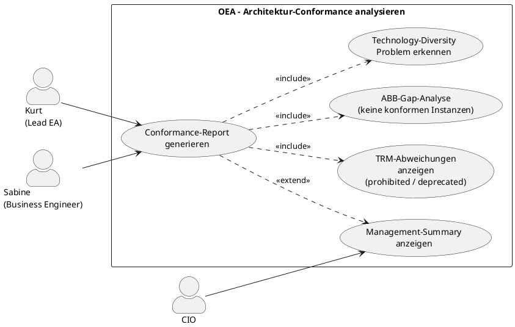

# UC-20: Architektur-Conformance zum Continuum analysieren

## Diagramm

## Goal in Context

Ein gepflegtes Enterprise Continuum hat nur dann Wert, wenn die tatsächliche Architektur regelmässig damit abgeglichen wird. Abweichungen müssen sichtbar sein: Welche Entitäten nutzen verbotene Produkte? Welche ABBs haben keine konformen Instanzen (Gap)? Welche TRM-Kategorien sind mit zu vielen verschiedenen Produkten besetzt (Technology Diversity Problem)?

UC-20 ist ein reiner Analyse-UC — er verändert keine Daten, sondern macht Conformance-Lücken und Standards-Drift für Kurt und den CIO sichtbar. Die eigentlichen Korrekturen erfolgen in UC-05/06 (Entität bearbeiten), UC-17 (SBB-Governance anpassen) oder UC-19 (TRM aktualisieren).

## Persona und Story

**Primärer Akteur**: [Kurt – Lead Enterprise Architekt](../../business-analysis/stakeholders/SH-03-kurt-lead-enterprise-architekt.md)

**Weitere Beteiligte**:
- [CIO](../../business-analysis/stakeholders/SH-05-cio-konzern.md) (liest den Conformance-Report als Management-Summary)
- [Sabine – Senior Business Engineer](../../business-analysis/stakeholders/SH-07-sabine-business-engineer.md) (nutzt die Analyse zur Standardisierungs-Initiative)

**Story**: Als Lead Enterprise Architekt möchte ich sehen, wo unsere tatsächliche Landschaft von den definierten ABB-Standards, SBB-Governance-Regeln und TRM-Vorgaben abweicht — damit ich gezielte Massnahmen ableiten kann.

## Trigger

1. Regelmässiger Architecture-Review-Termin (quartalsweise)
2. Neues Produkt wurde als `prohibited` gesetzt → sofortige Prüfung, wie viele Entitäten betroffen sind
3. Vorbereitung eines Technology-Standardisierungs-Projekts

## Vorbedingungen (Pre-Conditions)

- [ ] Kurt ist eingeloggt (UC-01) und hat Leseberechtigung auf das Repository
- [ ] Das Enterprise Continuum (ABBs, SBBs, TRM) ist konfiguriert (UC-17–19)
- [ ] Mindestens einige Entitäten haben `conformsToABBId`, `instanceOfSBBId` oder `trmClassificationIds` gesetzt

## Nachbedingungen (Post-Conditions)

- Kein Datensatz wurde verändert; der UC ist rein lesend
- Kurt hat eine aktuelle Übersicht der Conformance-Lücken und kann Massnahmen ableiten

## Hauptablauf (Basic Flow)

*Standardfall: Kurt öffnet das Conformance-Dashboard und analysiert die aktuelle Situation*

1. **Kurt**: öffnet den Bereich „Continuum Conformance" im EA-Dashboard
2. **System**: zeigt drei Analyse-Sektionen mit Zusammenfassungen:

   **Sektion 1 – ABB-Abdeckung**
   - Gesamt-ABBs: 52 (approved) / davon ohne konforme Instanz: 14 → Gap-Quote 27%
   - Tabelle: ABB-Name | continuumLevel | Konforme Instanzen | SBBs vorhanden | Status
   
   **Sektion 2 – Standards-Drift (SBB-Governance)**
   - Entitäten mit `instanceOfSBBId=prohibited`: 3
   - Entitäten mit `instanceOfSBBId=deprecated`: 7
   - Entitäten ohne SBB-Referenz, aber TRM-Kategorie gesetzt: 21
   - Tabelle: Entität | Entitätstyp | genutzter SBB | Governance-Status | TRM-Kategorie | Preferred Standard

   **Sektion 3 – Technology Diversity (TRM)**
   - TRM-Kategorien mit > 1 `approved`-SBB: 4 → Standardisierungspotenzial
   - TRM-Kategorien ohne `preferredStandard`: 9
   - Tabelle: TRM-Kategorie | Anzahl genutzter SBBs | preferred Standard | Entitäten-Zählung

3. **Kurt**: klickt in Sektion 2 auf „Entitäten mit prohibited SBB" (3 Einträge)
4. **System**: zeigt die 3 Entitäten mit Details: Name, Entitätstyp, genutzter SBB („Oracle Database 11g – prohibited"), TRM-Kategorie, zuletzt geändert von wem und wann
5. **Kurt**: klickt auf eine Entität → Sprung zur Entitäts-Detailansicht (UC-05)
6. **Kurt**: kehrt zurück zum Conformance-Dashboard und exportiert den Report

## Alternative Abläufe (Alternative Flows)

**A1 – ABB-Gap-Analyse im Detail**

1. **Kurt**: klappt in Sektion 1 einen ABB auf (z.B. „Message Broker")
2. **System**: zeigt:
   - Konforme Instanzen: 0 (Gap)
   - Implementierende SBBs: [SBB „Apache Kafka 3.x" – approved], [SBB „RabbitMQ" – acceptable]
   - Hinweis: „Kein physischer Message Broker in der Landschaft klassifiziert — ggf. fehlende TRM-Zuordnung"
3. **Kurt**: klickt „Entitäten suchen" → zeigt alle Entitäten mit Entitätstyp-Namen, die semantisch passen könnten (Freitext-Suche, kein automatischer Match)

**A2 – Report für CIO exportieren**

1. **Kurt**: klickt „Report exportieren" → wählt Format (PDF, CSV)
2. **System**: erzeugt einen Report mit Executive Summary (Gap-Quote, Drift-Zählung, Top-3-Risiken) und Detailtabellen
3. **CIO**: erhält den Report per Download oder E-Mail-Link

**A3 – Technology-Diversity-Massnahme ableiten**

1. **Kurt**: öffnet eine TRM-Kategorie mit 3 genutzten SBBs (z.B. „Container Orchestration": Kubernetes EKS, AKS, On-Prem Kubernetes)
2. **System**: zeigt alle Entitäten mit SBB-Referenzen in dieser Kategorie; gruppiert nach SBB
3. **Kurt**: erkennt: 2 Entitäten nutzen On-Prem-Kubernetes; geplante Migration zu EKS → trägt diese Erkenntnis als Grundlage für eine neue Solution (UC-05) ein

**A4 – Filter nach Plateau oder Solution**

1. **Kurt**: aktiviert den Filter „Nur Entitäten in Plateau P1 (Target 2027)"
2. **System**: zeigt Conformance-Analyse gefiltert auf Entitäten des gewählten Plateaus
3. **Kurt**: prüft, ob das geplante Target-Plateau schon Standards-konform ist

## Datenfluss

| Schritt | Daten | Richtung | Bemerkung |
|---|---|---|---|
| 2 | Conformance-Kennzahlen und Tabellen | System → Kurt | Rein lesend; keine Änderungen |
| 3–4 | Detail-Liste betroffener Entitäten | System → Kurt | Mit Sprunglink zur Entitäts-Detailansicht |
| A2 | PDF/CSV-Report | System → Kurt | Executive Summary + Detailtabellen |

## Beteiligte Business Objects

| Business Object | Operation | Notiz |
|---|---|---|
| [architecture-building-block](../../business-objects/architecture-building-block.md) | read | ABB-Gap-Analyse |
| [solution-building-block](../../business-objects/solution-building-block.md) | read | Governance-Status je SBB |
| [trm-category](../../business-objects/trm-category.md) | read | Technology-Diversity-Analyse |
| [entity](../../business-objects/entity.md) | read | `conformsToABBId`, `instanceOfSBBId`, `trmClassificationIds` |
| [person](../../business-objects/person.md) | read | `changedBy` in Entitäts-Details |
| [role](../../business-objects/role.md) | read | Leseberechtigung |

## Business Rules

| Rule-ID | Aussage | Auslöser |
|---|---|---|
| BR-01 | UC-20 ist rein lesend — kein Schreibzugriff auf Repository-Daten | immer |
| BR-02 | Conformance-Kennzahlen werden on-demand berechnet (kein gecachter Snapshot); Ausnahme: Export-Report darf gecacht werden (max. 1 Stunde) | onRead |

## Akzeptanzkriterien

- [ ] Drei Analyse-Sektionen: ABB-Abdeckung, Standards-Drift, Technology Diversity
- [ ] ABB-Abdeckung: Gap-Quote und Tabelle ABB × konforme Instanzen × SBBs
- [ ] Standards-Drift: Entitäten mit prohibited/deprecated SBB klar hervorgehoben; Sprunglink zur Entität
- [ ] Technology Diversity: TRM-Kategorien mit Entitäten-Zählungen und preferred Standard
- [ ] A1: ABB-Gap-Drill-Down zeigt implementierende SBBs und Hinweis auf fehlende TRM-Klassifizierung
- [ ] A2: Export als PDF und CSV; mit Executive Summary
- [ ] A4: Filter nach Plateau oder Solution
- [ ] Rein lesender UC: keine Datenänderung möglich

## Nicht im Scope

- **Korrekturen an Entitäten** (SBB-Zuweisung, TRM-Klassifizierung ändern): UC-05/UC-06
- **SBB-Governance-Status ändern**: UC-17
- **TRM-SBB-Zuordnungen anpassen**: UC-19
- **Automatisierte Conformance-Checks als CI/CD-Gate**: deferred v2.0
